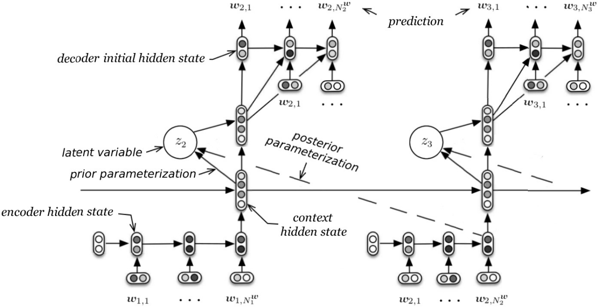

#### A Hierarchical Latent Variable Encoder-Decoder Model for Generating Dialogues

##### 研究动机

自然语言本身具有多样性，不同的对话主题、发言者的目的、发言者的语言风格也会对一场对话的语句间多样性造成影响，然而先前的模型生成语句时缺乏多样性。本文通过引入latent variable，对这种多样性进行建模。

##### 模型算法

$w_1, w_2, \cdots, w_N$为$N$个序列，其中$w_n = (w_{n, 1}, w_{n, 2}, \cdots, w_{n, M_n})$，$z_n$为stochastic latent variable，于是
$$
\begin{aligned}
P_{\theta}(z_n | w_1, w_2, \cdots, w_{n - 1}) & = \mathcal{N}(\mu_{\rm prior}(w_1, w_2, \cdots, w_{n - 1}), \Sigma_{\rm prior}(w_1, w_2, \cdots, w_{n - 1})) \\
P_{\theta}(w_n | z_n, w_1, w_2, \cdots, w_{n - 1}) & = \prod_{m = 1}^{M_n} P_{\theta}(w_{n, m} | z_n, w_1, w_2, \cdots, w_{n - 1}, w_{n, 1}, w_{n, 2}, \cdots, w_{n, m - 1})
\end{aligned}
$$
其中$\Sigma_{\rm prior}$为对角矩阵。模型包含encoder、context、decoder三个RNN，encoder为每个序列编码，context以序列编码作为输入为前文编码，context编码结果被送入带有$\tanh$激活函数的双层FFN，然后使用一个矩阵乘法得到$\mu_{\rm prior}$，使用另一个矩阵乘法并加以softplus激活函数得到$\Sigma_{\rm prior}$。在优化过程中，模型最大化ELBO，即
$$
\begin{aligned}
\log P_{\theta}(w_1, w_2, \cdots, w_N) & \ge \sum_{n = 1}^N \mathbb{E}_{Q_{\psi}(z_n | w_1, w_2, \cdots, w_n)}[\log P_{\theta}(w_n | z_n, w_1, w_2, \cdots, w_{n - 1})] \\
& - {\rm KL}[Q_{\psi}(z_n | w_1, w_2, \cdots, w_n) || P_{\theta}(z_n | w_1, w_2, \cdots, w_{n - 1})] \\
Q_{\psi}(z_n | w_1, w_2, \cdots, w_N) & = Q_{\psi}(z_n | w_1, w_2, \cdots, w_n) \\
& = \mathcal{N}(\mu_{\rm posterior}(w_1, w_2, \cdots, w_n), \Sigma_{\rm posterior}(w_1, w_2, \cdots, w_n)) \\
& \approx P_{\psi}(z_n | w_1, w_2, \cdots, w_N)
\end{aligned}
$$
在test过程中，根据先验概率采样$z_n$，并且拼接context的编码结果作为decoder的输入。在train过程中，根据后验概率采样$z_n$，此时context编码结果与encoder编码结果共同送入单层FFN，然后使用与之前类似的方法计算$\mu_{\rm posterior}$和$\Sigma_{\rm posterior}$。

##### 实验结果

* 根据人为评价，模型超越baselines（LSTM和HRED），尤其擅长生成有意义的长文本。
* 根据指标评价，模型相比baselines更能保持上下文的主题，生成的语句长度和熵均更大。
