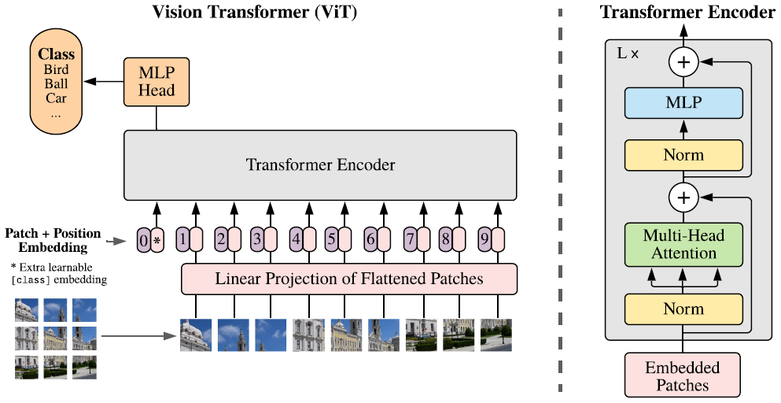

#### An Image is Worth 16x16 Words: Transformers for Image Recognition at Scale

##### 模型架构

图片切分为若干正方形patches，每个patch通过线性层映射为对应的embedding，在整个序列头部拼接分类作用的embedding。序列的所有位置加上1D-Position-Embedding，Position Embedding同样需要学习。经过Transformer Encoder后，在起分类作用的位置后增加全连接层进行分类。

微调阶段使用更高分辨率的图片会起到更好的效果，但是会缺乏相应的Position Embedding，因此使用2D插值进行补全。

##### 实验结论

* 1D-Position-Embedding效果不比2D-Position-Embedding差，而且实验结果说明同样能学到二维信息。
* 强的正则化（Weight Decay，Dropout，Label Smoothing）有利于Vit训练。

* 使用大规模数据集进行预训练，效果能够超越具备图像Inductive Bias的ResNets。
* 能够通过更小的计算量达到更高的精度表现。

##### 遗留问题

* 把ViT应用于其他计算机视觉任务，例如目标检测和图像分割。
* 探索自监督预训练方法，现在使用的Masked Patch Prediction方法实验结果不如监督预训练。
