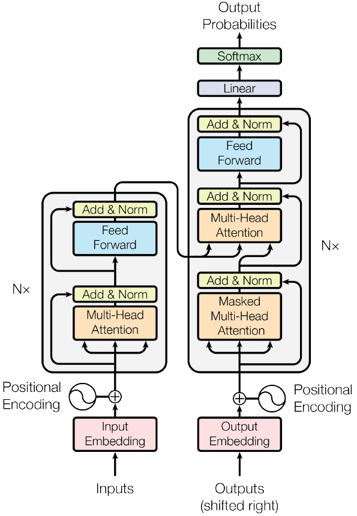

#### Attention Is All You Need

##### 模型架构

##### 公式分析

* 注意力机制
  $$
  \begin{aligned}
  \rm{Attention}(Q, K, V) & = \rm{softmax}(\frac{Q K^T}{\sqrt{d_k}}) V \\
  \rm{head}_i & = \rm{Attention}(Q W_i^Q, K W_i^K, V W_i^V) \\
  \rm{MultiHead} & = \rm{Concat}(\rm{head}_1, \rm{head}_2, \cdots, \rm{head}_h) W^O
  \end{aligned}
  $$

* Positional Encoding
  $$
  \begin{aligned}
  PE_{(pos, 2 i)} & = \sin \frac{pos}{10000^{\frac{2 i}{d_{\rm{model}}}}} \\
  PE_{(pos, 2 i + 1)} & = \cos \frac{pos}{10000^{\frac{2 i}{d_{\rm{model}}}}}
  \end{aligned}
  $$

Self-Attention的优势在于计算复杂度较低、可平行计算、有利于长距离依赖。

##### 实验结果

* 模型performance达到SOTA，且training cost更低。
* 一般来说模型规模越大performance越好，attention head的数量适中为好。

##### 未来工作

把Transformer扩展应用到图像、音频、视频等拥有更大输入输出的模态。
