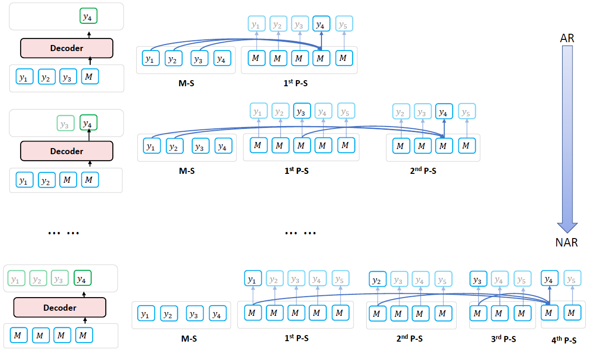
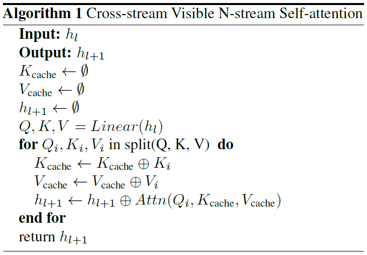

#### BANG: Bridging Autoregressive and Non-autoregressive Generation with Large Scale Pretraining

##### 模型架构

##### 实验结果

* 在Question Generation、Summarization、Dialog任务上performance超过大多数模型。
* 在NAR（Non-Autoregressive）上运行速度快，在Semi-NAR和AR上performance优秀。
