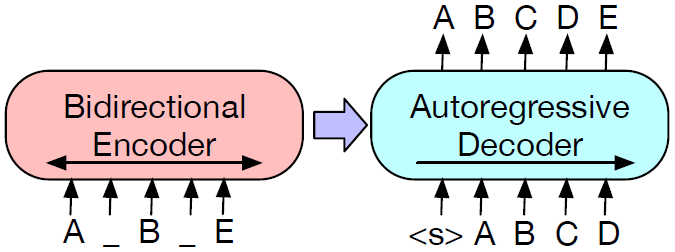
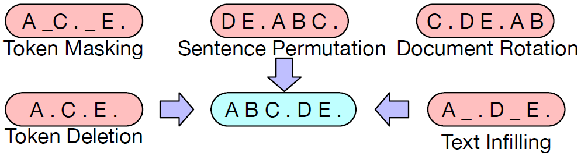
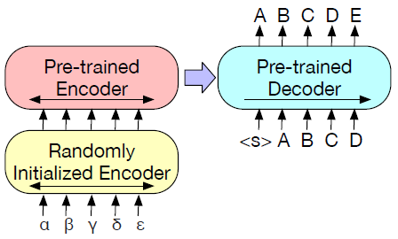

#### BART: Denoising Sequence-to-Sequence Pre-training for Natural Language Generation, Translation, and Comprehension

##### 模型架构

与Transformer相同，但使用GeLUs激活函数，参数初始化$\mathcal{N}(0, 0.02)$。

##### 预训练任务

* Token Masking：与BERT相同，随机采样token替换为[MASK]。
* Token Deletion：随机删除token。
* Text Infilling：随机采样一段连续的文本，长度服从$\lambda = 3$的泊松分布，整体替换为一个[MASK]。
* Sentence Permutation：随机打乱句子顺序。
* Document Rotation：随机选取一个token作为起点，做循环移位。

##### 微调任务

* Sequence Classification：对Encoder和Decoder输入同样的文本，Decoder最后一层的最后一个hidden state作为representation用于线性分类。
* Token Classification：对Encoder和Decoder输入同样的文本，Decoder最后一层的hidden states作为representations用于分类。
* Sequence Generation：对Encoder输入文本，Decoder自回归生成序列。
* Machine Translation：用一个新的随机初始化的Encoder代替BART原本的embedding层，训练分为两步，第一步只训练新的随机初始化的Encoder、BART Positional Embedding、BART Encoder第一层的Self-Attention输入映射矩阵，第二步用较少的迭代次数训练所有参数。

##### 预训练实验结果

* 不同预训练方法的效果与学习任务高度相关，同样的预训练方法，在某任务上可能取得很好的performance，在另一任务上可能取得很差的performance。
* 循环移位文本和句子顺序重排单独使用效果很差，deletion和mask相关的方法效果较好，其中对于生成式任务deletion比mask要更好一些。
* left-to-right预训练有利于生成式任务。
* 双向Encoder对于SQuAD很重要，而且BART成功做到了这一点。
* 预训练方法不是影响performance的唯一因素。
* 在ELI5上纯粹的Language Model效果最好，说明BART对于输出不被输入紧密限制的任务效果较差。
* BART使用Text Infilling拥有最强的consistently performance。

##### 微调实验结果

* 在判别式任务上，BART总体和RoBERTa表现相当，说明BART在使用Decoder提升生成式任务表现的同时没有以牺牲判别式任务表现为代价。
* 在summarization、dialogue、abstractive QA等生成式任务上表现达到SOTA。
* 在翻译任务上表现超越Transformer baseline，但初步的结果说明现在的方法如果没有回译数据效果会较差，而且容易过拟合。

##### 未来工作

探索新的破坏文本的预训练方法，或者为终端任务特别制定预训练方法。
