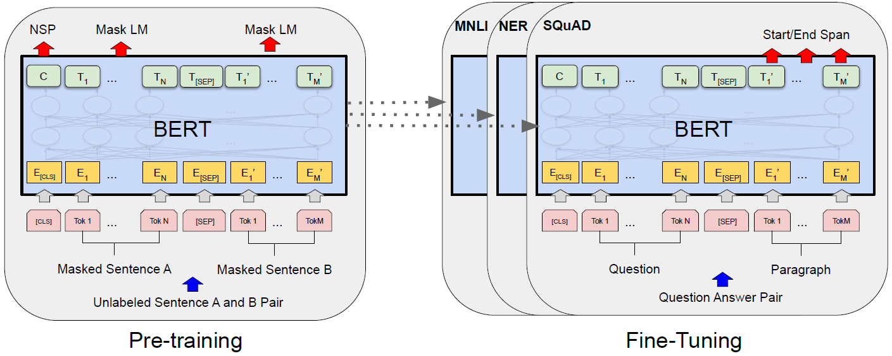
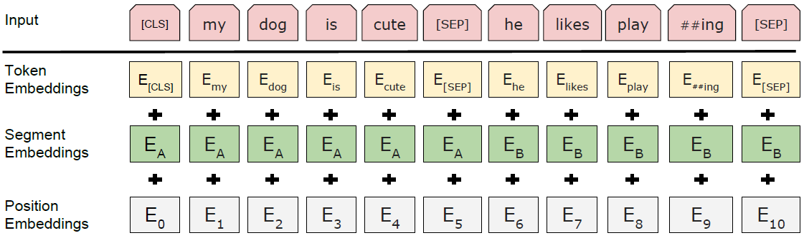

#### BERT: Pre-training of Deep Bidirectional Transformers for Language Understanding

##### 模型架构

模型架构即为Transformer Encoder，模型输入为token、segment、position三者embedding相加。[CLS]放在序列最前面用于分类，[SEP]放在两句各自的末尾用于分隔。

##### 预训练任务

* MLM（Masked Language Model）：随机挑选15%的token用于预测，在这些token中，80%被替换为[MASK]，10%被替换为随机token，10%保持不变。
* NSP（Next Sentence Prediction）：预测后一个句子在实际语义上是否紧跟前一个句子。

##### 微调实验结果

在多项任务上performance超越前人的工作。

##### Ablation实验结果

* 双向Encoder和NSP预训练任务都起到明显效果。
* 模型规模可以很大程度影响performance。
* BERT对于finetune和feature-based均有效。
