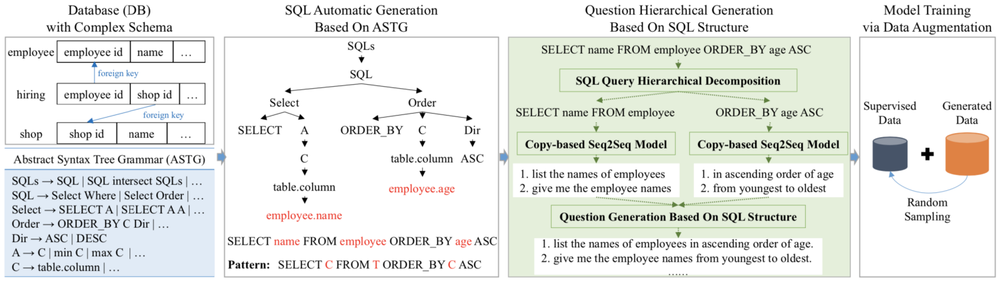

#### Data Augmentation with Hierarchical SQL-to-Question Generation for Cross-domain Text-to-SQL Parsing

##### 数据扩增方法

* SQL查询的生成

  根据ASTG从简到繁生成sketch树，对于特定的复杂度（树宽和树高），生成所有可能的sketch树，然后针对不同的数据库填入不同的具体值。为了更好地匹配真实训练数据的分布并且限制生成的SQL查询语句的数量，当生成的patterns覆盖原始训练数据的80%时停止生成sketch树。

* 多层级的SQL到问题的生成

  1. SQL子句分解：通常来说一个子句包含一个SQL关键词，除了两种情况会使得多个SQL关键词出现在同一个子句中，一种是由于SQL语义，也就是说GROUP_BY和HAVING绑定、ORDER_BY和LIMIT绑定，另一种是由于自然语言问题意图与SQL查询实现细节的不匹配，为了更好地对齐二者，GROUP_BY与SELECT或ORDER_BY合并，对于嵌套结构的SQL查询则将外部的WHERE与内部的SELECT合并。
  2. 子句到子问题的翻译：使用带有拷贝机制的序列到序列模型，在输入层拼接词嵌入向量和token类型（column，table，value，others）嵌入向量。关于训练数据的构造，SQL子句分解的方法与前述一样，而对于自然语言问题的分解，首先使用与schema linking类似的方式对齐SQL查询和问题语句，然后定义子句对应的子问题为包含子句中所有数据库元素的最短问题片段，最后舍弃置信度低的数据，例如子问题之间有较大重合，如果一个子问题完全覆盖另一个子问题，则保留较短的子问题。
  3. 问题组合：有两种方式将所有子问题拼接为一个完整的问题，一种是按照执行顺序（WHERE->GROUP_BY->HAVING->SELECT，ORDER_BY->LIMIT），一种是按照SQL子句顺序，实验证明前一种方式更好。
  
* 三种使用生成数据的方法

  1. 使用生成数据进行pretrain，使用原始数据进行finetune。
  2. 直接合并原始数据和生成数据，然后训练模型。
  3. 随机采样与原始数据一样多的生成数据，合并后进行训练。

##### 实验结果

* 多层级的SQL到问题的生成方式优于前人工作，而且可以提升更强的baselines的性能。
* 扩增数据的规模越大，模型性能提升越多，而且方差越小，说明越多的扩增数据带来越稳定的提升。
* 对于三种使用生成数据的方法，第一种对模型性能提升较少，后两种提升较多，其中第二种较第三种提升更多一些，但第三种较第二种训练效率更高。
