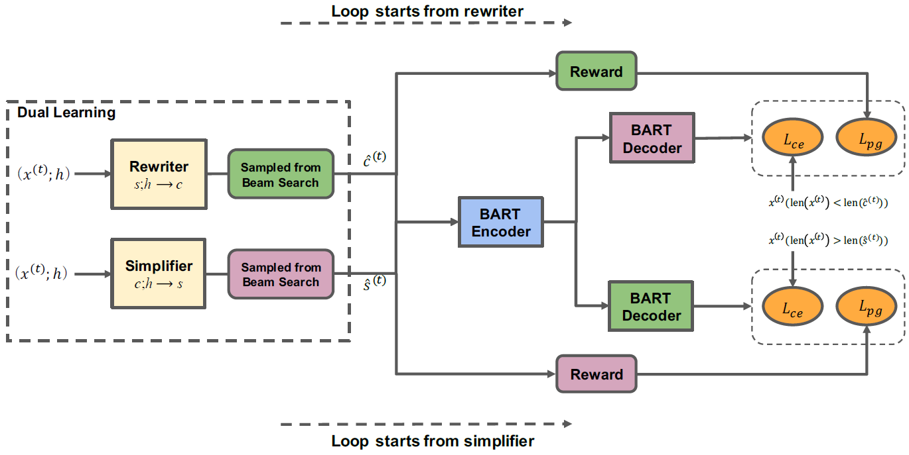
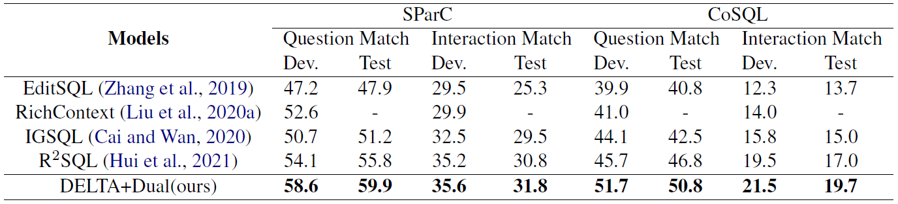

#### Decoupled Dialogue Modeling and Semantic Parsing for Multi-Turn Text-to-SQL

##### 模型方法

* 改写器
  * Token-level Reward：生成DB相关的token加0.1分，生成共指现象的代词减0.1分。
  * Sentence-level Reward：语言模型的概率衡量改写流畅度，语义还原度可以由用户衡量，或者根据text-to-SQL模型是否能预测出正确的SQL语句来衡量。
* 简化器
  * Token-level Reward：生成DB相关的token减0.1分，生成共指现象的代词加0.1分。
  * Sentence-level Reward：语言模型的概率衡量简化流畅度。

##### 实验结果

