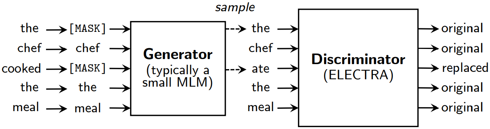

#### Electra: Pre-training Text Encoders as Discriminators Rather Than Generators

##### 模型架构

使用Masked Language Model作为生成器，将原语言序列中的部分单词替换，然后使用一个判别器判断每个单词是否被替换。生成器和判别器都架构均为Transformer Encoder。在finetune阶段去除生成器部分。
$$
\mathcal{L} = \sum_{x \in \mathcal{X}} \mathcal{L}_{\rm MLM}(x, \theta_G) + \lambda \mathcal{L}_{\rm Disc}(x, \theta_D)
$$

##### 实验结果

* 生成器与判别器共享参数有利于提升模型性能，原因在于判别器只能优化出现在输入中的tokens，而生成器由于在词表上做softmax操作，可以优化所有tokens。
* 较小的生成器有利于提升模型性能。
* 强化学习和两阶段学习的训练方式均不如联合训练。

##### 模型优势

* 不需要[MASK]作为特殊token，避免pretrain和finetune的不匹配。
* 模型可以同时优化输入中的所有tokens，BERT只能优化其中的15%，计算效率极大提升。
* 性能优秀，使用更少的计算资源，获得优于RoBERTa、XLNet等模型的性能。