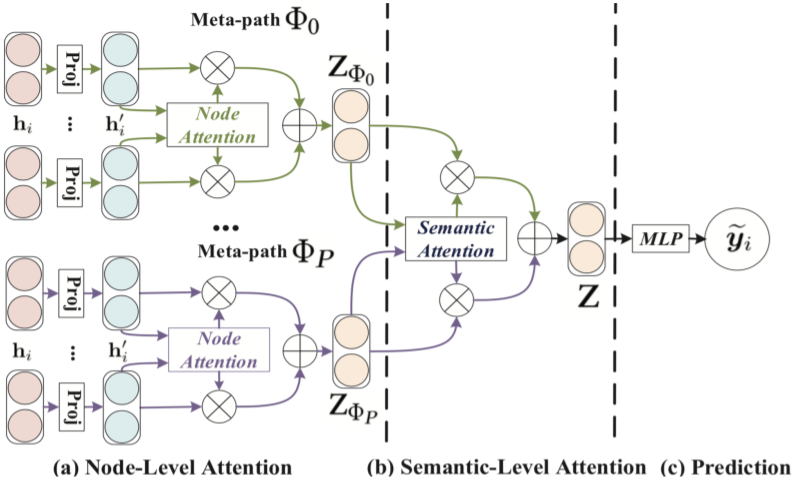
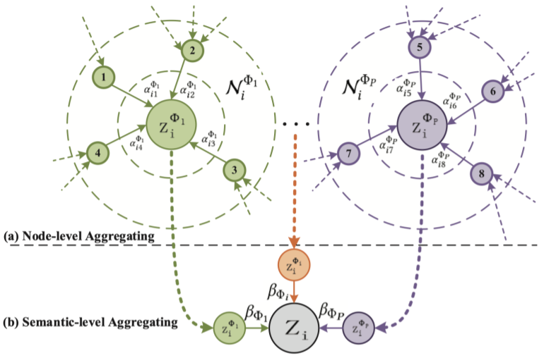

#### Heterogeneous Graph Attention Network

##### 预备知识

一个异构图可以表示为$\mathcal{G} = (\mathcal{V}, \mathcal{E})$，并且具备节点类型映射函数$\phi: \mathcal{V} \rightarrow \mathcal{A}$和边类型映射函数$\psi: \mathcal{E} \rightarrow \mathcal{R}$，其中$|\mathcal{A}| + |\mathcal{R}| > 2$。一个meta-path $\Phi$定义为$A_1 \stackrel{R_1}{\rightarrow} A_2 \stackrel{R_2}{\rightarrow} \cdots \stackrel{R_l}{\rightarrow} A_{l + 1}$（缩写为$A_1 A_2 \cdots A_{l + 1}$），描述了从$A_1$到$A_{l + 1}$的复合关系$R = R_1 \circ R_2 \circ \cdots \circ R_l$。对于一个节点$i$和一个meta-path $\Phi$，节点的meta-path based邻居集合$\mathcal{N}_i^{\Phi}$定义为$i$通过$\Phi$末端连接到的节点集合（包括$i$本身）。

##### 模型架构

$h$是节点的初始features，令$M_{\phi_i}$为节点类型$\phi_i$的转移矩阵，
$$
h'_i = M_{\phi_i} \cdot h_i
$$
于是不同类型的节点被映射到同一特征空间上。对于由meta-path $\Phi$连接的一对节点$(i, j)$，
$$
\begin{aligned}
e_{i j}^{\Phi} & = {\rm att_{node}}(h'_i, h'_j; \Phi) \\
\alpha_{i j}^{\Phi} & = {\rm softmax}(e_{i j}^{\Phi}) = \frac{\exp(\sigma(a_{\Phi}^T \cdot [h'_i || h'_j]))}{\sum_{k \in \mathcal{N}_i^{\Phi}} \exp(\sigma(a_{\Phi}^T \cdot [h'_i || h'_k]))}
\end{aligned}
$$
于是节点$i$关于$\Phi$的meta-path based embedding为
$$
z_i^{\Phi} = \sigma(\sum_{j \in \mathcal{N}_i^{\Phi}} \alpha_{i j}^{\Phi} h'_j)
$$
实际应用时使用multihead attention，并拼接各个head的结果。至此，给定meta-path集合$\{\Phi_1, \cdots, \Phi_P\}$，得到$P$组embeddings，表示为$\{Z_{\Phi_1}, \cdots, Z_{\Phi_P}\}$。对于每个meta-path的attention分数，计算方式为
$$
\begin{aligned}
w_{\Phi_p} & = \frac{1}{|\mathcal{V}|} \sum_{i \in \mathcal{V}} q^T \cdot \tanh(W \cdot z_i^{\Phi_p} + b) \\
\beta_{\Phi_p} & = \frac{\exp(w_{\Phi_p})}{\sum_{p' = 1}^P \exp(w_{\Phi_{p'}})}
\end{aligned}
$$
所有节点的最终embeddings为
$$
Z = \sum_{p = 1}^P \beta_{\Phi_p} \cdot Z_{\Phi_p}
$$

##### 实验结果

* performance在ACM、DBLP、IMDB三个数据集上达到SOTA。
* 节点和语义上的注意力机制各自均起到作用。
* 聚类效果明显优于针对homogeneous图或者单一meta-path的模型。
* $Z$和$q$的embedding维度适中为好，注意力的效果整体随着head数量增加而提升。
