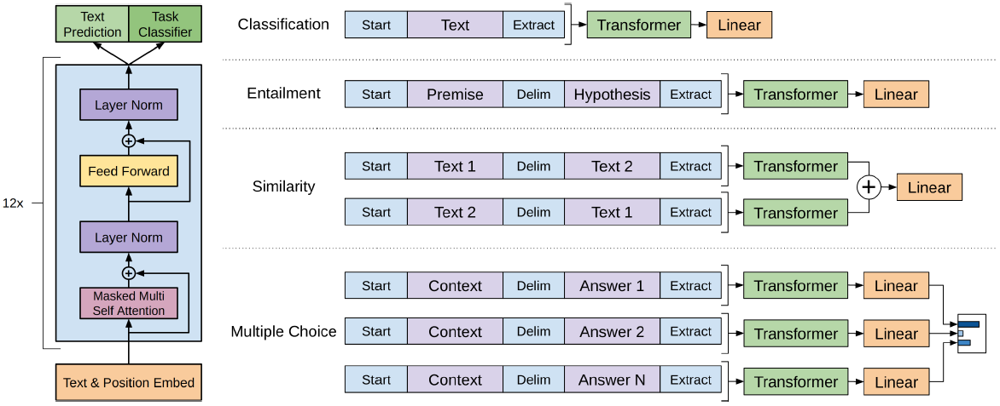

#### Improving Language Understanding by Generative Pre-Training

##### 模型架构

模型采用Transformer Decoder的结构。

##### 预训练目标

最优化语言模型。
$$
L_1(\mathcal{U}) = \sum_i \log P(u_i | u_{i - k}, \cdots, u_{i - 1}; \Theta)
$$

##### 微调目标

最优化实际任务目标，并以最优化语言模型作为辅助目标。辅助目标能够提升模型泛化能力，加速模型参数收敛。
$$
L_2(\mathcal{C}) = \sum_{(x, y)} \log P(y | x^1, \cdots, x^m) \\
L_3(\mathcal{C}) = L_2(\mathcal{C}) + \lambda \cdot L_1(\mathcal{C})
$$

##### 实验结果

* 模型在Natural Language Inference、Question Answering、Sentence Similarity、Classification等任务的多个数据集上取得SOTA的performance。
* 在从unsupervised到supervised的迁移过程中，每个layer的参数都起作用。
* 在zero-shot实验中，模型的performance随着预训练步数增加而稳步提升，说明Transformer架构中的inductive bias有助于迁移。
* 语言模型辅助目标有利于大数据集学习，不利于小数据集学习。
