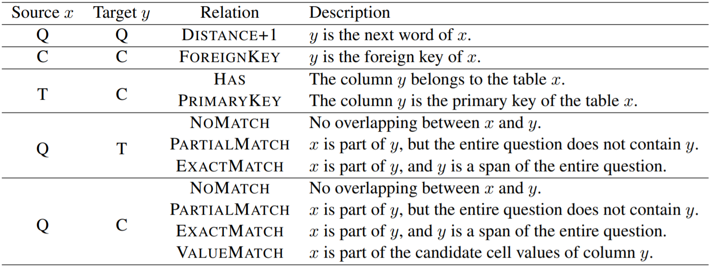
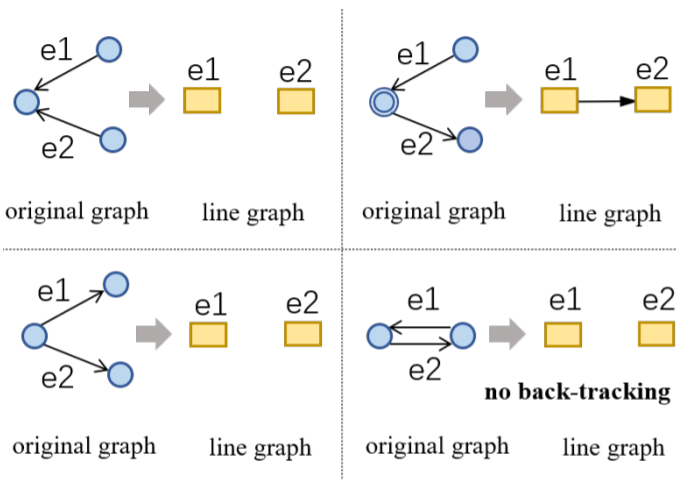
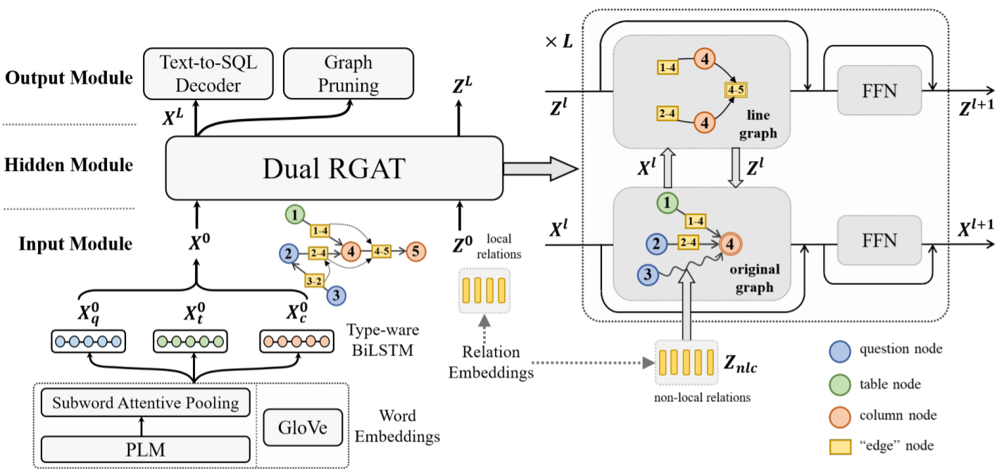

#### LGESQL: Line Graph Enhanced Text-to-SQL Model with Mixed Local and Non-Local Relations

##### 预备知识

* 问题定义

  令自然语言问题为$Q = (q_1, q_2, \cdots, q_{|Q|})$，数据库schema为$S = T \bigcup C$，目标为生成SQL语句$y$。对于数据库schema，tables为$T = \{t_1, t_2, \cdots\}$，columns为$C = \{c_1^{t_1}, c_2^{t_1}, \cdots, c_1^{t_2}, c_2^{t_2}, \cdots\}$，其中$t_i = (t_{i 1}, t_{i 2}, \cdots), c_j^{t_i} = (c_{j 1}^{t_i}, c_{j 2}^{t_i}, \cdots)$，此外$t_{i 0}$为“table”，$c_{j 0}^{t_i}$代表列$c_j^{t_i}$的类型（TEXT和NUMBER）。node-centric图$G^n = (V^n, R^n)$，其中$V^n = Q \bigcup T \bigcup C$。

* Meta-Path

  一条meta-path表示为$\tau_1 \stackrel{r_1}{\rightarrow} \tau_2 \stackrel{r_2}{\rightarrow} \cdots \stackrel{r_l}{\rightarrow} \tau_{l + 1}$，其中$\tau_i \in \{\rm{QUESTION}, \rm{TABLE}, \rm{COLUMN}\}$，它描述了一条从$\tau_1$到$\tau_{l + 1}$的关系链$r = r_1 \circ r_2 \circ \cdots \circ r_l$。长度为1的关系链为local，大于1的为non-local。$R^n$中同时包含了local和non-local的关系，下图展示了所有local的关系（仅展示单向，反向同理）。

  

  NOMATCH关系会极大提升line graph中边的数量，因此移除line graph中两个端点均为MATCH类型的边。

* Line graph

  

  在构建line graph $G^e = (V^e, R^e)$时，仅使用$R^n$中的local关系构建$V^e$，防止在line graph中创造过多节点。

##### 模型架构

LGESQL整体包含graph input module、line graph enhanced hidden module、graph output module三个模块，其中前两个模块将图$G^n$转换为node embeddings $X \in \R^{|V^n| \times d}$，输出模块将$X$转换为SQL语句$y$。

* Graph Input Module

  该模块提供初始节点和边的embeddings。初始local边的特征$Z^0 \in \R^{|V^e| \times d}$和non-local边的特征$Z_{\rm{nlc}} \in \R^{(|R^n| - |V^e|) \times d}$直接从参数矩阵获取，而节点的表示可以通过word vectors GLOVE或PLM（例如BERT）得到。

  * GLOVE

    对于问题或schema item中的每个单词，首先获取其embedding，然后针对问题、table、column使用三个不同的双向LSTM获取上下文表示。对于问题中的单词$q_i$，拼接其前向和后向hidden states作为$x_{q_i}^0$；对于表$t_i$，拼接前向和后向各自的last hidden states作为$x_{t_i}^0$；对于列同理。这些表示共同组成$X^0 \in \R^{|V^n| \times d}$。

  * PLM

    将问题和schema items展成一个序列$[\rm{CLS}] q_1 q_2 \cdots q_{|Q|} [\rm{SEP}] t_{1 0} t_1 c_{1 0}^{t_1} c_1^{t_1} c_{2 0}^{t_1} c_2^{t_1} \cdots t_{2 0} t_2 c_{1 0}^{t_2} c_1^{t_2} c_{2 0}^{t_2} c_2^{t_2 } \cdots [\rm{SEP}]$。由于每个单词$w$会被拆分为子词，故令其经过PLM后的最终表示为$w_1^s, w_2^s, \cdots, w_{|w|}^s$，
    $$
    \begin{aligned}
    a_i & = \rm{softmax}_i (\tanh(w_i^s W_s) v_s^T) \\
    w & = \sum_i a_i w_i^s
    \end{aligned}
    $$
    $W_s$和$v_s$是可学习的参数。获得单词级别的表示后，同样使用三个不同的双向LSTM获取$X^0$。

* Line Graph Enhanced Hidden Module

  该模块包含$L$个dual relational graph attention network（Dual RGAT）层，每层有两个RGATs，分别捕获原图和线图的结构信息。令$X^l \in \R^{|V^n| \times d}$代表第$l$层的原图输入embeddings，节点$v_i^n \in V^n$对应为$x_i^l$，同理$Z^l \in \R^{|V^e| \times d}$和$z_i^l$代表对应的线图embeddings。
  $$
  \begin{aligned}
  X^{l + 1} & = \rm{RGAT}^n(X^l, [Z^l; Z_{\rm{nlc}}], G^n) \\
  Z^{l + 1} & = \rm{RGAT}^e(Z^l, X^l, G^e)
  \end{aligned}
  $$

  * 原图RGAT
    $$
    \begin{aligned}
    \tilde{\alpha}_{j i}^h & = (x_i^l W_q^h) (x_j^l W_k^h + [\psi(r_{j i}^n)]_h^H)^T \\
    \alpha_{j i}^h & = \rm{softmax}_j (\frac{\tilde{\alpha}_{j i}^h}{\sqrt{\frac{d}{H}}}) \\
    \tilde{x}_i^l & = \rm{Concat}_{h = 1}^H \sum_{v_j^n \in \mathcal{N}_i^n} \alpha_{j i}^h (x_j^l W_v^h + [\psi(r_{j i}^n)]_h^H) \\
    \tilde{x}_i^{l + 1} & = \rm{LayerNorm}(x_i^l + \tilde{x}_i^l W_o) \\
    x_i^{l + 1} & = \rm{LayerNorm}(\tilde{x}_i^{l + 1} + \rm{FFN}(\tilde{x}_i^{l + 1}))
    \end{aligned}
    $$
    $\mathcal{N}_i^n$是节点$v_i^n$的接受域，$\psi(r_{j i}^n)$基于关系$r_{j i}^n$返回一个$d$维向量。由于关系有local和non-local两种，故设计两种方案进行处理。

    * Mixed Static and Dynamic Embeddings

      
