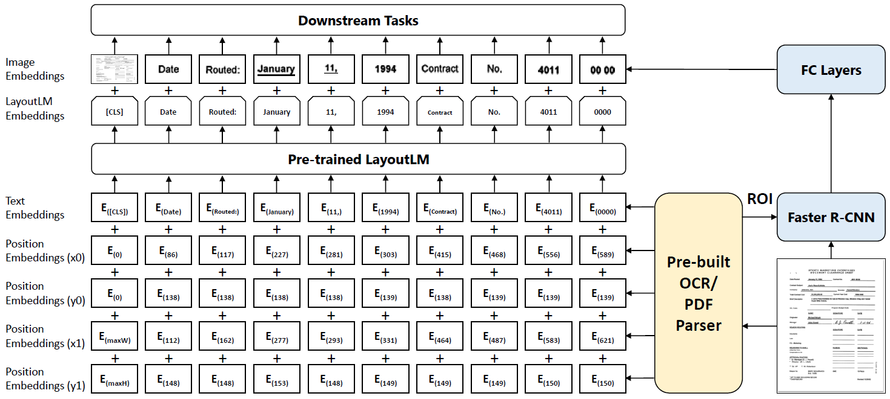

#### LayoutLM: Pre-training of Text and Layout for Document Image Understanding

##### 模型架构

对于文档中的文字，使用词嵌入加上2D-Position-Embedding，Position Embedding对文字所处位置的左上角和右下角的横纵坐标进行编码嵌入。文字对应的图片信息使用Faster R-CNN进行编码嵌入。[CLS]处使用整个文档的位置和图片信息进行编码嵌入，用于分类。词嵌入与位置嵌入叠加后进入预训练LayoutLM模型学习得到LayoutLM Embedding，将其与Image Embedding拼接，进而进行下游任务的学习。

Pre-trained LayoutLM使用BERT结构作为backbone，Faster R-CNN使用ResNet-101作为backbone。

##### 预训练任务

* MVLM（Masked Visual-Language Model）：随机mask部分tokens，但保留对应的2D-Position-Embedding。
* MDC（Multi-label Document Classification）：多标签文档预测，但大数据集可能没有标签，故这是可选项。

##### 微调任务

* Form Understanding：表单理解，使用BIOES进行序列标注。
* Receipt Understanding：收据理解，使用BIOES进行序列标注。
* Document Image Classification：文档图像分类，使用[CLS]进行分类。

##### 实验结果

* Text+Layout+Image MVLM的学习效果显著。
* 更大规模的数据集和更高的epochs带来更好的精度表现。
* 初始化LayoutLM的方法中RoBERTa>BERT>SCRATCH。

##### 遗留问题

尚未把Image Embedding纳入预训练阶段。