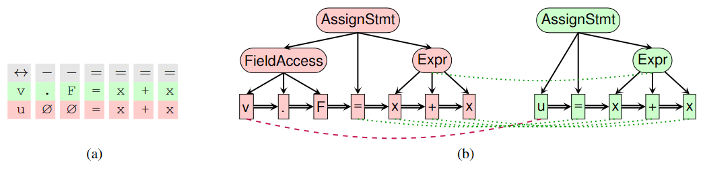

#### Learning to Represent Edits

##### 任务定义

* Edit Representation：通过编辑前文本$x_-$和编辑后文本$x_+$生成编辑表示$f_\Delta(x_-, x_+) \in \R^n$。
* Neural Editor：通过编辑前文本$x_-$和编辑表示$f_\Delta(x_-, x_+) \in \R^n$生成编辑后文本$x_+$。

##### 模型方法

