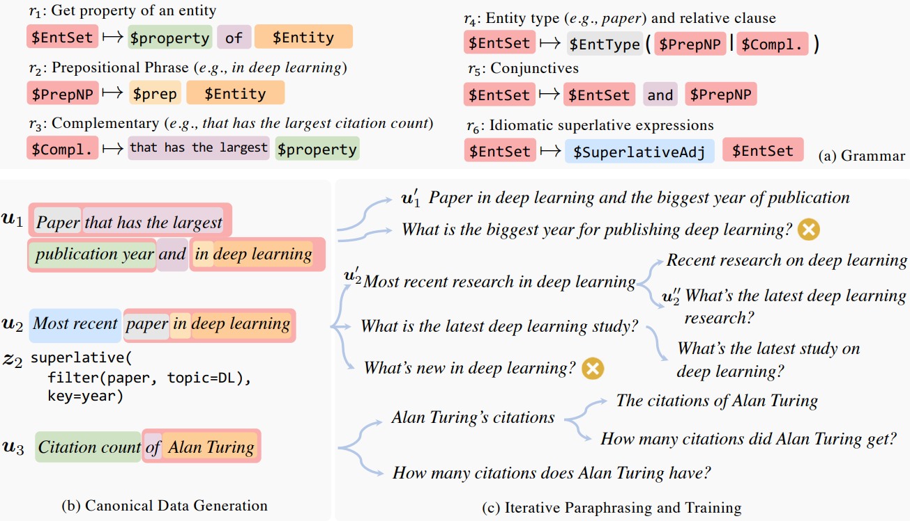

#### On The Ingredients of an Effective Zero-shot Semantic Parser

##### 研究动机

在数据扩增的过程中，缩小生成数据与真实数据的language gap和logical gap，其中language gap指真实数据比生成数据使用的语言更丰富且贴近真实语言习惯，logical gap指真实数据比生成数据覆盖更多的逻辑pattern。

##### 技术方法

* 数据生成

  

  首先使用同步上下文无关文法（Synchronous Context Free Grammar，SCFG）生成一个canonical数据集$\mathbb{D}_{\rm can}$，然后finetune一个BART模型用于paraphrase其中的语句。在每次迭代中，一个semantic parser基于paraphrased examples进行训练，使用上一轮迭代的semantic parser作为过滤器，过滤掉paraphrased examples中不能被过滤器正确预测的数据样例。最终得到的paraphrased canonical数据集为$\mathbb{D}_{\rm par}$。

* 缩小language gap

  加入符合语言习惯的语法规则。

  multi-hop：如author that writes paper whose topic is NLP $\rightarrow$ author that works on NLP。

  比较级和最高级：如paper that has the largest publication year and in deep learning $\rightarrow$ most recent paper in deep learning。

* 缩小logical gap

  首先根据语法扩展深度$d$对canonical数据集进行分类得到$\mathbb{D}_{\rm can}^{(d)}$，对于其中的样例$<u, z>$，使用语言模型GPT-2 XL计算语句的概率（即自然度）$p_{\rm LM}(u)$，然后将具有同样program模板的样例聚类为group。对于每个group，找到具有最高概率的样例$<u^*, z>$，排除这个group中其他概率过低的样例，即$\ln p_{\rm LM}(u^*) - \ln p_{\rm LM}(u) > \delta (\delta = 5.0)$。最后根据$p_{\rm LM}(u^*)$为$\mathbb{D}_{\rm can}^{(d)}$中的所有groups排序，保留其中的top-$K$ groups。

* 生成验证集

  首先执行前述迭代paraphrasing算法，然后从数据集中按照概率$p(u, z) \propto p_{\rm LM}(u)^{\alpha} (\alpha = 0.4)$采样得到验证集$\mathbb{D}_{\rm par}^{\rm val}$。

##### 实验结果

* 在使用无标签数据的方法中表现最好，但是跟监督学习的方法相比仍有一定的差距。
* 加入符合语言习惯的语法规则可以明显提升模型性能，降低PPL（缩小language gap），提升logical覆盖率（缩小logical gap）。
* 合适的$K$有利于模型性能，过小的$K$会造成logical gap，过大的$K$会引入脱离真实用户意图的数据样例。

##### 局限性

* 过滤器为上一轮迭代中训练得到的结果，准确率较低，故容易在过滤时误判。
* canonical数据集中仍有不自然的语句。
* $\mathbb{D}_{\rm can}$中还存在逻辑过于复杂以至于几乎不会在真实数据中出现的数据样例。
