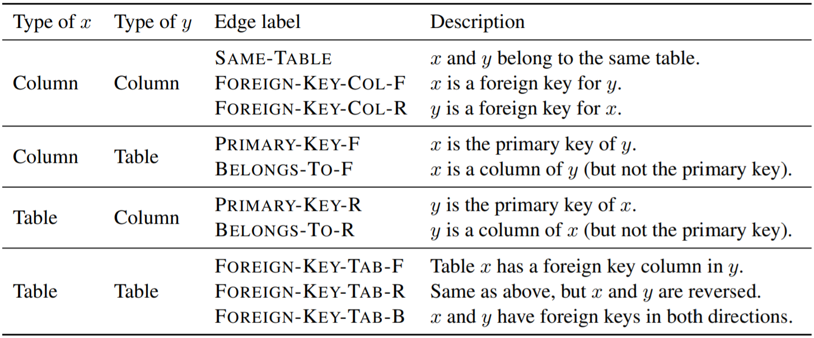

#### RAT-SQL: Relation-Aware Schema Encoding and Linking for Text-to-SQL Parsers

##### Relation-Aware Self-Attention

对于一组输入$X = \{x_i\}_{i = 1}^n$，其中$x_i \in \R^{d_x}$，经过典型Transformer Encoder会得到
$$
\begin{aligned}
e_{i j}^{(h)} & = \frac{x_i W_Q^{(h)} (x_j W_K^{(h)})^T}{\sqrt{\frac{d_z}{H}}} \\
\alpha_i^{(h)} & = \rm{softmax}(e_i^{(h)}) \\
z_i^{(h)} & = \sum_{j = 1}^n \alpha_{i j}^{(h)} (x_j W_V^{(h)}) \\
z_i & = [z_i^{(1)}; \cdots; z_i^{(H)}] \\
\tilde{y}_i & = \rm{LayerNorm}(x_i + z_i) \\
y_i & = \rm{LayerNorm}(\tilde{y}_i + \rm{FC}(\rm{ReLU}(\rm{FC}(\tilde{y}_i))))
\end{aligned}
$$
$H$为attention head数量。为了表现数据库schema中原有的关系，采用类似于relative position的方法，
$$
\begin{aligned}
e_{i j}^{(h)} & = \frac{x_i W_Q^{(h)} (x_j W_K^{(h)} + r_{i j}^K)^T}{\sqrt{\frac{d_z}{H}}} \\
z_i^{(h)} & = \sum_{j = 1}^n \alpha_{i j}^{(h)} (x_j W_V^{(h)} + r_{i j}^V)
\end{aligned}
$$
考虑$R$个关系特性$\mathcal{R}^{(s)} \in X \times X (1 \le s \le R)$，于是$r_{i j}^K = r_{i j}^V = [\rho_{i j}^{(1)}; \cdots; \rho_{i j}^{(R)}]$，其中对于$\rho_{i j}^{(s)}$，如果$(i, j) \in \mathcal{R}^{(s)}$，那么其为一个可学习的embedding，否则为零向量。

##### 模型架构

* 问题定义

  令$Q = q_1 \cdots q_{|Q|}$为自然语言问题，$S = \langle \mathcal{C}, \mathcal{T} \rangle$为数据库schema，其中$\mathcal{C} = \{c_1, \cdots, c_{|\mathcal{C}|}\}$（$c_i = c_{i, 1} \cdots c_{i, |c_i|}$）为column集合，$\mathcal{T} = \{t_1, \cdots, t_{|\mathcal{T}|}\}$（$t_i = t_{i, 1} \cdots t_{i, |t_i|}$）为table集合。每个column有一个类型$\tau \in \{\rm{number}, \rm{text}\}$。定义schema对应的有向图$\mathcal{G} = \langle \mathcal{V}, \mathcal{E} \rangle$，其中$\mathcal{V} = \mathcal{C} \bigcup \mathcal{T}$，节点以其名字作为标签（对于column还需前置其类型），边集$\mathcal{E}$的定义如下图。

  

  尽管该有向图包含了schema的所有信息，它不足以为以$Q$为上下文背景的未见过的schema编码，故定义图$\mathcal{G}_Q = \langle \mathcal{V}_Q, \mathcal{E}_Q \rangle$，其中$\mathcal{V}_Q = \mathcal{V} \bigcup Q, \mathcal{E}_Q = \mathcal{E} \bigcup \mathcal{E}_{Q \leftrightarrow S}$。
  
* 编码

  对于column和table，其初始表示$c_i^{\rm{init}}, t_i^{\rm{init}}$来自于

  * 对每个单词获取预训练好的embedding；
  * 对于多单词标签，将上述embedding用双向LSTM处理。

  同样用一个单独的双向LSTM处理问题$Q$，得到问题的初始表示$q_i^{\rm{init}}$。于是relation-aware self-attention的输入为
  $$
  X = (c_1^{\rm{init}}, \cdots, c_{|\mathcal{C}|}^{\rm{init}}, t_1^{\rm{init}}, \cdots, t_{|\mathcal{T}|}^{\rm{init}}, q_1^{\rm{init}}, \cdots, q_{|\mathcal{Q}|}^{\rm{init}})
  $$
  可选项：使用BERT架构处理$X$，使用BERT最终的表示作为每一项的初始表示。

* Schema Linking

  * Name-Based Linking

    显然如果问题中的部分单词可以和column或table名匹配，两者可以建立关系。具体而言，对于问题中所有长度在1到5之间的n-grams，确定其是否完美或部分匹配于某个column或table，然后确定是否向边集$\mathcal{E}_{Q \leftrightarrow S}$添加边QUESTION-COLUMN-M、QUESTION-TABLE-M、COLUMN-QUESTION-M、TABLE-QUESTION-M，其中M为EXACTMATCH、PARTIALMATCH、NOMATCH之一。

  * Value-Based Linking

    如果问题中单词$q_i$出现在列$c_j$的值（或者是值内的一个完整单词）中，则增加一条新关系COLUMN-VALUE。

* Auxiliary Linking

  对于$x_i, x_j \in \mathcal{V}_Q$：

  * 若$i = j$，则增加COLUMN-IDENTITY或TABLE-IDENTITY；
  * 若$x_i, x_j \in Q$，则增加QUESTION-DIST-$d$，其中$d = \rm{clip}(j - i, D)$；
  * 否则增加COLUMN-COLUMN、COLUMN-TABLE、TABLE-COLUMN、TABLE-TABLE之一。

* Memory-Schema Alignment Matrix

  直观上出现在SQL语句中的column和table会在问题中有对应，因此计算矩阵$L^{\rm{col}} \in \R^{|y| \times |\mathcal{C}|}$和$L^{\rm{tab}} \in \R^{|y| \times |\mathcal{T}|}$。
  $$
  \begin{aligned}
  \tilde{L}_{i, j}^{\rm{col}} & = \frac{y_i W_Q^{\rm{col}} (c_j^{\rm{final}} W_K^{\rm{col}} + r_{i j}^K)^T}{\sqrt{d_x}} \\
  \tilde{L}_{i, j}^{\rm{tab}} & = \frac{y_i W_Q^{\rm{tab}} (t_j^{\rm{final}} W_K^{\rm{tab}} + r_{i j}^K)^T}{\sqrt{d_x}} \\
  L_i^{\rm{col}} & = \rm{softmax}(\tilde{L}_i^{\rm{col}}) \\
  L_i^{\rm{tab}} & = \rm{softmax}(\tilde{L}_i^{\rm{tab}})
  \end{aligned}
  $$
  使用交叉熵损失函数进行优化，
  $$
  align\_loss = - \frac{1}{|Rel(\mathcal{C})|} \sum_{j \in Rel(\mathcal{C})} \log \max_i L_{i, j}^{\rm{col}} - \frac{1}{|Rel(\mathcal{T})|} \sum_{j \in Rel(\mathcal{T})} \log \max_i L_{i, j}^{\rm{tab}}
  $$
  $Rel(\mathcal{C})$和$Rel(\mathcal{T})$分别代表出现在SQL语句中的column和table的集合。实验表明，这项优化会使performance有略微提升，但没有显著提升。

* 解码

  使用LSTM生成抽象语法树，每一步或扩展最后生成的节点至一条语法规则（APPLYRULE），或从schema中选择一项column或table（SELECTCOLUMN，SELECTTABLE）。
  $$
  m_t, h_t = f_{\rm{LSTM}}([a_{t - 1} || z_t || h_{p_t} || a_{p_t} || n_{f_t}], m_{t - 1}, h_{t - 1})
  $$
  $m_t$为LSTM cell state，$h_t$为LSTM output，$a_{t - 1}$为上一个动作的embedding，$p_t$为当前时间步对应的父节点，$n_{f_t}$为当前节点类型的embedding，$z_t$为$h_{t - 1}$对encoder结果的multi-head attention上下文表示。对于APPLYRULE[R]，
  $$
  \rm{Pr}(a_t = APPLYRULE[R] | a_{< t}, y) = \rm{softmax}(g(h_t))
  $$
  $g(\cdot)$为一个2层的MLP，具有一个$\tanh$非线性。对于SELECTCOLUMN，
  $$
  \begin{aligned}
  \tilde{\lambda}_j & = \frac{h_t W_Q^{\rm{sc}} (y_j W_K^{\rm{sc}})^T}{\sqrt{d_x}} \\
  \lambda & = \rm{softmax}(\tilde{\lambda}) \\
  \rm{Pr}[a_t = SELECTCOLUMN[i] | a_{< t}, y] & = \sum_{j = 1}^{|y|} \lambda_j L_{j, i}^{\rm{col}}
  \end{aligned}
  $$
  对于SELECTTABLE则类似。

##### 实验结果

* 在Spider数据集上performance达到SOTA，而且泛化能力较强，dev和test测试差距较小。
* RAT-SQL+BERT有助于提升performance和泛化能力。
* schema linking relations、schema graph relations、value-based linking均起到重要作用。
* 在WikiSQL数据集上没有达到SOTA，但performance仍然competitive，原因在于RAT-SQL对于value decoding做了简化，仅为token-based pointer机制，即只能解码单个token的value。
* 在错误的预测中，结构错误和column或table错误占比均较高，均需要未来工作。
