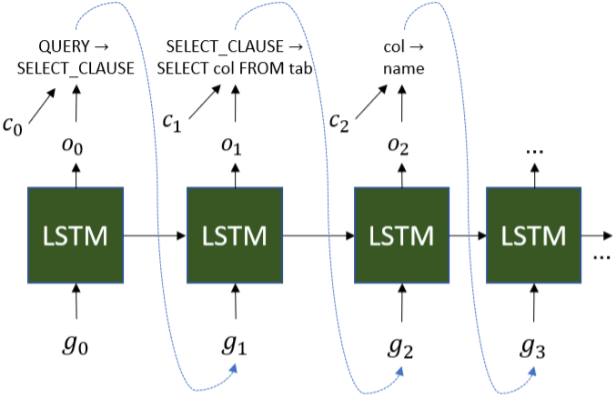
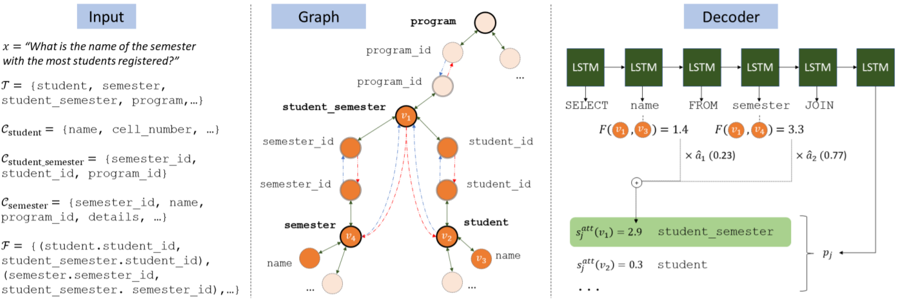

#### Representing Schema Structure with Graph Neural Networks for Text-to-SQL Parsing

##### 模型架构

令$x$代表自然语言问题，$y$代表对应的SQL查询语句，$S$代表数据库schema。其中$S$包括：

* 数据库tables集合$\mathcal{T}$；
* 对于每个$t \in \mathcal{T}$，columns集合$\mathcal{C}_t$；
* 外键集合$\mathcal{F}$，对于$(c_f, c_p) \in \mathcal{F}$，$c_f$为外键列名，$c_p$为另一个表中的主键列名。

定义schema items为$\mathcal{V} = \mathcal{T} \bigcup \{\mathcal{C}_t\}_{t \in \mathcal{T}}$。

* Linking Schema Items

  为了处理未曾见过的schema items，学习一个相似度分数$s_{\rm{link}}(v, x_i)$，其中$v$的类型是$\tau$（包括table、string column、number column等），$x_i$是问题$x$的第$i$个单词。定义
  $$
  p_{\rm{link}}(v | x_i) = \frac{\exp(s_{\rm{link}}(v, x_i))}{\sum_{v' \in \mathcal{V}_{\tau} \bigcup \{\empty\}} \exp(s_{\rm{link}}(v', x_i))}
  $$
  $\mathcal{V}_{\tau}$是类型为$\tau$的schema items的集合，$s_{\rm{link}}(\empty, \cdot) = 0$是为不link任何schema item的单词而准备。
  
* Encoder（Basic）

  一个双向LSTM为每个单词$x_i$提供一个上下文表示$h_i$，双向LSTM第$i$位的输入为$[w_{x_i}; l_i]$，其中$w_{x_i}$为$x_i$的word embedding，
  $$
  l_i = \sum_{\tau} \sum_{v \in \mathcal{V}_{\tau}} p_{\rm{link}}(v | x_i) \cdot r_v
  $$
  $r_v$是关于$v$的一个可学习embedding，基于$v$的类型和它的schema neighbors。

* Decoder（Basic）

  

  使用一个grammar-based LSTM decoder，在解码的每一步，一个non-terminal会通过一条语法规则扩展，语法规则或为schema-independent（生成non-terminals或者SQL关键字），或为schema-specific（生成schema items）。对于解码的第$j$步，LSTM的输入为$g_j$，输出为$o_j$，其中$g_j$是上一步解码得到的语法规则对应的embedding，如果该规则为schema-independent，则$g_j$是一个可学习的global embedding，如果该规则为schema-specific且生成schema item $v$，则$g_j$是一个基于$\tau(v)$（$v$的类型）的可学习的embedding。Attention机制为
  $$
  \begin{aligned}
  a'_{j, i} & = h_i^T o_j \\
  a_j & = \rm{softmax}(a'_j) \\
  c_j & = \sum_i a_{j, i} h_i
  \end{aligned}
  $$
  现在可以计算当前解码的语法规则的概率分布为
  $$
  \begin{aligned}
  s_j^{\rm{glob}} & = \rm{FF}([o_j; c_j]) \in \R^{G^{\rm{legal}}} \\
  s_j^{\rm{loc}} & = S_{\rm{link}} a_j \in \R^{\mathcal{V}_{\rm{legal}}} \\
  p_j & = \rm{softmax}([s_j^{\rm{glob}}; s_j^{\rm{loc}}])
  \end{aligned}
  $$
  $G_{\rm{legal}}$和$\mathcal{V}_{\rm{legal}}$分别是当前解码这一步合法的schema-independent和schema-specific规则数量。$s_j^{\rm{glob}}$根据feed-forward网络计算得到，$s_j^{\rm{loc}}$根据一个由$s_{\rm{link}}$值组成的矩阵$S_{\rm{link}} \in \R^{\mathcal{V}_{\rm{legal}} \times |x|}$计算得到。

##### 编码分析

* Schema-to-Graph

  

  把schema转换成一张图，定义图的节点为所有schema items，然后添加三种边：

  * 对于表$t$中的列$c_t$，将边$(c_t, t)$和$(t, c_t)$添加至边集$\mathcal{E}_{\leftrightarrow}$；
  * 对于外键关系$(c_{t_1}, c_{t_2})$，将边$(c_{t_1}, c_{t_2})$和$(t_1, t_2)$添加至边集$\mathcal{E}_{\rightarrow}$，将边$(c_{t_2}, c_{t_1})$和$(t_2, t_1)$添加至边集$\mathcal{E}_{\leftarrow}$。

* Question-Conditioned Relevance

  在问题条件下，部分schema是无关的，例如上图中只有橙色的点与问题有关。对于schema item $v$，定义其相关分数
  $$
  \rho_v = \max_i p_{\rm{link}}(v | x_i)
  $$

* Neural Graph Representation

  定义节点$v$的初始embedding为$h_v^{(0)} = r_v \cdot \rho_v$，然后执行$L$步GNN循环，
  $$
  \begin{aligned}
  a_v^{(l)} & = \sum_{\rm{type} \in \{\rightarrow, \leftrightarrow\}} \sum_{(u, v) \in \mathcal{E}_{\rm{type}}} W_{\rm{type}} h_u^{(l - 1)} + b_{\rm{type}} \\
  h_v^{(l)} & = \rm{GRU}(h_v^{(l - 1)}, a_v^{(l)})
  \end{aligned}
  $$
  最终表示为$\varphi_v = h_v^{(L)}$。

##### 模型修改

* Encoder（Final）

  替换前述$l_i$为
  $$
  l_i^{\varphi} = \sum_{\tau} \sum_{v \in \mathcal{V}_{\tau}} p_{\rm{link}}(v | x_i) \cdot \varphi_v
  $$

* Decoder（Final）

  对于解码时LSTM的输入，前述（Basic）中提到，如果schema item $v$被解码，那么下一步的输入为$\tau(v)$对应的embedding，此处则替换为$\varphi_v$。已生成的schema item会对后续有影响，所以需要增加self-attention机制。对于解码的第$j$步，令$u_j$为decoder的hidden state，$\hat{J} = (i_1, \cdots, i_{|\hat{J}|})$为先前解码出schema item的时间步，$\hat{U}_{d \times |\hat{J}|} = [u_{i_1}, \cdots, u_{i_{|\hat{J}|}}]$。
  $$
  \begin{aligned}
  \hat{a}_j & = \rm{softmax}(\hat{U}^T u_j) \\
  s_j^{\rm{att}} & = \hat{a}_j S^{\rm{att}} \\
  p_j & = \rm{softmax}([s_j^{\rm{glob}}; s_j^{\rm{loc}} + s_j^{\rm{att}}])
  \end{aligned}
  $$
  $S^{\rm{att}}$是一个$|\hat{J}| \times \mathcal{V}_{\rm{legal}}$的矩阵，$S_{v_1, v_2}^{\rm{att}} = F(\varphi_{v_1})^T F(\varphi_{v_2})$，其中$F(\cdot)$是一个feed-forward网络。

##### 实验结果

* performance达到SOTA。
* 各个组件（GNN、self-attention、相关分数）均起到重要作用。
