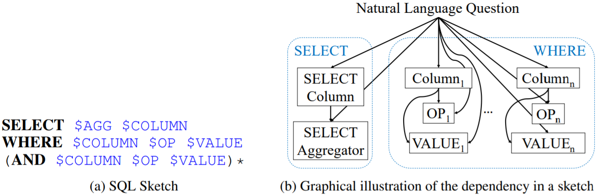

#### SQLNet: Generating Structured Queries from Natural Language Without Reinforcement Learning

##### 模型架构

* Sketch-Based

  

  通过sketch-based预测slot值的方式，避免order-matters的问题。

* Sequence-to-Set和Column-Attention

  预测column names的一个子集，用于条件子句中。令$H_Q$为一个$d \times L$（$d$为embedding size，$L$为问题的sequence length）的矩阵，其中$H^Q$的第$i$列$H_Q^i$代表问题的第$i$个token经过双向LSTM的hidden state。令$E_{col}$和是column name的embedding，由双向LSTM计算得到，计算$H_Q$和$E_{col}$的两个双向LSTM不共享参数权值。
  $$
  \begin{aligned}
  v_i & = E_{col}^T W H_Q^i \\
  w & = \rm{softmax}(v) \\
  E_{Q | col} & = H_Q w \\
  P_{\rm{wherecol}}(col | Q) & = \sigma((u_a^{col})^T \tanh(U_c^{col} E_{col} + U_q^{col} E_{Q | col}))
  \end{aligned}
  $$
  $W_{d \times d}$是一个可训练矩阵，$U_c^{col}$和$U_q^{col}$是两个$d \times d$的可训练矩阵，$u_a^{col}$是一个$d$维的可训练向量。

* SQLNet

  * 预测WHERE子句

    * Column Slots

      首先预测一个$K$值，然后选取$P_{\rm{wherecol}}(col | Q)$中的top-$K$作为WHERE子句中的$K$个columns。预设$K$的上界为$N$，于是对$K$的预测转化为$0$到$N$的$(N + 1)$分类问题。
      $$
      P_{\rm{\# col}}(K | Q) = \rm{softmax}(U_1^{\rm{\# col}} \tanh(U_2^{\rm{\# col}} E_{Q | Q}))
      $$
      $U_1^{\rm{\# col}}$是一个$(N + 1) \times d$的可训练矩阵，$U_2^{\rm{\# col}}$是一个$d \times d$的可训练矩阵。

    * OP Slot

      
