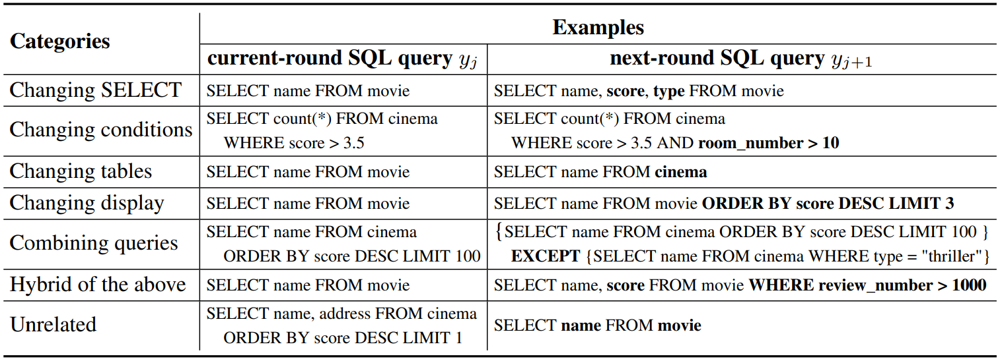
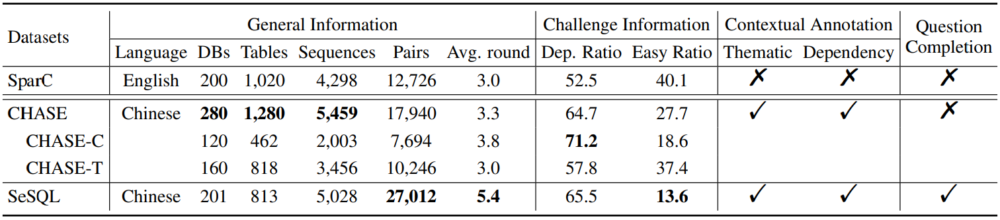
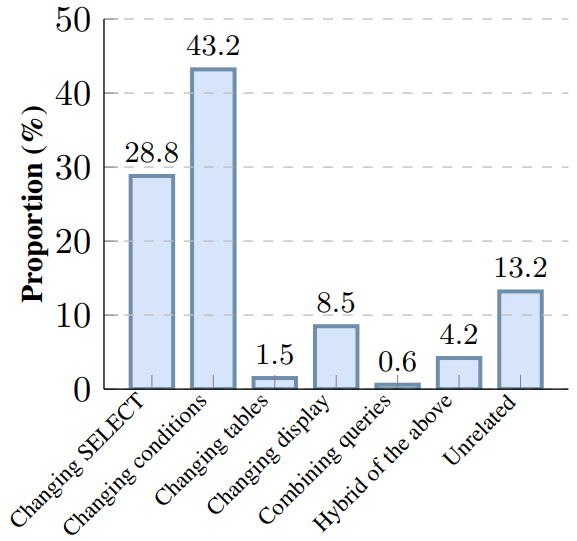
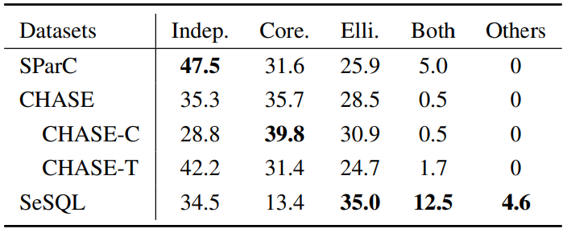
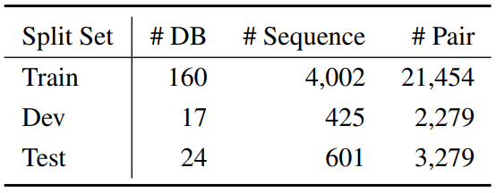
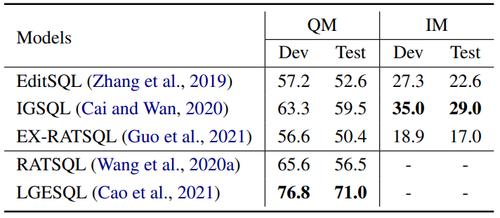
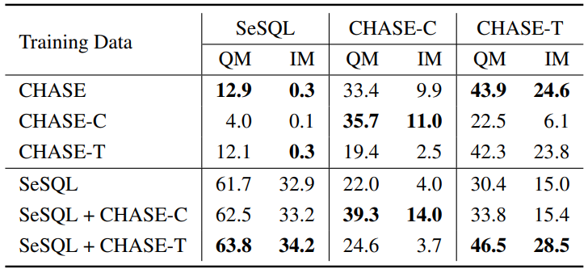
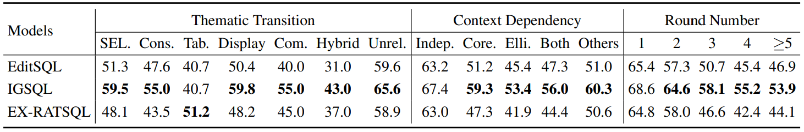

#### SeSQL: Yet Another Large-scale Session-level Chinese Text-to-SQL Dataset

##### 摘要

CHASE作为第一个会话级别的中文text-to-SQL数据集包含两部分，即CHASE-C（2003条人工构造的会话）和CHASE-T（3456条根据英文数据集SParC翻译而来的会话），这两个独立的部分差异很大、互不兼容，因此我们提出了新的数据集SeSQL，包含5028条人工构造的会话。为确保数据质量，我们采用一个迭代标注工作流，以促进针对前一轮自然语言问题和SQL查询的复核审查。此外，通过补全上下文相关的会话，我们获得了一个包含27012组问题/SQL对，这使得SeSQL也能够成为最大的单轮跨领域中文text-to-SQL数据集。我们使用三个具有竞争力的模型进行实验，并给出细节分析。

##### 绪论

text-to-SQL是关系型数据库的自然语言查询接口的关键技术，吸引了学术界和工业界的广泛研究兴趣，包括数据集构造和模型创新。

先前的工作主要聚焦于单轮text-to-SQL解析，包括WikiSQL、Spider、DuSQL等数据集。

然而现实世界中，用户可能同时有多个询问需求，或者由于对数据库结构的不熟悉，需要多轮对话才能完成查询。

因此近期的工作开始解决会话级别的text-to-SQL解析，给定数据库和自然语言问题，模型需要参考同一会话中之前所有的询问，输出准确的SQL查询语句。

目前，先前的工作已经构造了两个会话级别的数据集，即英文的SParC和中文的CHASE，其中SParC总共包含4298条会话和12726组问题/SQL对。

CHASE包含5459条会话和17940组问题/SQL对，CHASE的主要问题在于其构造过程中使用的混合方法，CHASE-C和CHASE-T可能由于文化和语言差异出现割裂的问题，而只使用CHASE-C可能不够支持模型训练。

我们的工作提出了SeSQL数据集，包含5028条会话和27012组问题/SQL对。我们的贡献总结如下：

1. SeSQL有三个特性，第一，我们采用一个迭代标注工作流以激励针对先前标注结果的仔细审查，第二，我们设计了七类主题过渡转变以指引标注者创建下一轮的SQL查询，第三，我们跟随CHASE明确标注相邻问题的上下文相关类型（例如省略和共指）。
2. 我们补全了17704条上下文相关的问题，从而产生了27012条上下文无关的问题，一方面可以提供最大的单轮跨领域中文text-to-SQL数据集，另一方面可以支持问题补全技术相关的研究。
3. 我们使用三个有竞争力的模型进行实验，分别是EditSQL、IGSQL、EX-RATSQL。

##### 相关工作

* 会话级别text-to-SQL

  目前英文的SParC和中文的CHASE是两个代表性的会话级别text-to-SQL数据集，SParC复用Spider数据集中的问题，其基本思想在于将Spider数据集中的问句拆分成一系列更简单的问句，最终回答原问题，这样的构造方法会导致两个biases，其一是高比例上下文无关问题，其二是高比例简单SQL查询。

  CHASE由CHASE-C和CHASE-T构成，CHASE-C复用DuSQL数据集中120个数据库，CHASE-T根据SParC数据集的一部分翻译而来，CHASE-C和CHASE-T之间存在明显的特性差异，而且CHASE-T继承了SParC的biases。

* 对话式text-to-SQL

  即基于数据库的对话式问答，CoSQL是这方面的英文数据集，除了生成SQL查询，模型还能向用户询问自然语言问题以澄清不明确的地方。

* 会话级别text-to-SQL解析方法

  EditSQL通过编辑上一轮的SQL查询，生成本轮SQL查询，它的encoder对本轮问题和先前所有问题之间的交互进行建模。IGSQL扩展了EditSQL，使用图编码对数据库items一起建模。EX-RATSQL扩展了RATSQL，拼接先前所有问题作为输入。

##### 数据集构建

SeSQL的构建主要包含五步：数据库收集和清理，初始SQL查询创建，问题/SQL生成，审查和最后的问题生成，补全上下文相关问题。

* 迭代标注工作流

  同一个标注者容易因为思维定势，发展出套路近似的会话。

  迭代标注工作流的基本思想在于一个标注者只完成一条自然语言问题和SQL查询，而且之前的结果也可以被后来的标注者审查。一个标注者可能同时需要完成六项子任务：

  1. 了解上下文：标注者首先阅读先前所有问题，确保了解会话的主题，避免问出重复或近似的问题。
  1. 检查先前的结果：标注者必须仔细检查并更正之前的标注结果，包括上一轮的自然语言问题和本轮的SQL查询，这一步对于避免错误累积非常重要。
  1. 写一条自然语言问题：正确且准确表达本轮SQL查询的含义，表达方式应当像现实生活中一样自然。
  1. 组建一条SQL查询：为下轮组建SQL查询。
  1. 通过交流验证正确性：如果当前标注者更正了错误，系统会将更正的内容发给原本的标注者，两人意见一致则成功更改，否则由级别更高的标注者决断。
  1. 发起结束会话的请求：标注者完成子任务2后，如果想不出更多的问题，可以发起结束会话的请求，级别更高的标注者会处理请求。一场会话的问题/SQL对的数量在3到10之间。
  
  迭代标注工作流可以很大程度上避免标注者陷入思维定势，而且标注结果可以得到及时的审查，避免错误累积，提升数据质量。
  
* 数据库收集和清理

  我们复用了DuSQL数据集中全部的包含813个表的201个数据库。

  DuSQL数据集中原本的数据库有很多噪声，主要分为四类：主键或外键未提供，值类型与字段类型不匹配，有些cells没有值，主键字段出现重复值。

  为确保数据库质量，高级别标注者更正了这些数据库。

* 初始SQL查询创建

  初始查询的质量取决于简单性和多样性两个方面，我们发现easy和medium难度的SQL查询比较符合简单性，多样性则要求初始SQL查询覆盖尽可能多的SQL关键词。为此我们从Spider和DuSQL中提取出60条SQL模板，对于给定的数据库，我们要求初始查询匹配其中一条模板（简单性），一条模板最多创建一条初始查询（多样性）。

  我们创建了5028条有效的初始查询，其中1761条来自DuSQL，3267条由我们的高级标注者编写。

* 问题/SQL生成

  之前提到会话中随后的问题和查询是由多名随机挑选的标注者创建的，每人只标注本轮问题和下轮查询，本小节专注于如何基于给定的上下文创建下轮的SQL查询。
  
  主题转变和相邻句间的上下文依赖的自然真实性很重要，其中主题转变取决于用户的信息需求，上下文依赖与复用先前的内容有关。我们主要考虑主题转变，因为复用前文内容通常是标注者的自然选择。
  
  我们设计了七类转变类型以表示本轮和下轮查询之间的关系，同时我们也允许标注者组建主题不相关的查询，因为这有时也会在现实场景中出现。
  
  
  
* 审查和最后的问题生成

  高级标注者收到结束会话的请求后，审查并更正先前所有的问题和SQL，然后为最后一轮的SQL写下自然语言问题。

* 补全上下文相关问题

  为了捕捉上下文依赖并且使数据集具有更广泛的应用性，我们在所有会话标注完之后单独执行这一步。

  每个会话被分配给一名高级标注者，高级标注者将其中有上下文依赖的问题改写为上下文无关的问题。根据统计，共有17704条上下文相关的问题，占总问题的65.5%。至此，SeSQL也可以像DuSQL一样作为一个单轮中文text-to-SQL数据集，也能够支持问题补全技术方面的研究。

  共有五种上下文依赖类型：无关，共指，省略，共指省略混合，其他。

* 其他标注细节

  我们招募28名本科生作为兼职标注者，6名硕士研究生作为高级标注者，他们都来自本校的计算机科学系且对SQL语言熟悉。

  在正式标注前，我们对标注者进行了若干次训练。正式标注期间，我们也开会讨论问题并解决争端。标注过程共持续半年。

  我们构建了一个在线的标注工具。

  标注者收到的报酬取决于标注的质量和数量。

##### SeSQL分析

* 基础统计

  

  第一，相较于英文数据集，SeSQL和CHASE拥有更多的会话和问题/SQL对。第二，SeSQL和CHASE都更有挑战性，因为有更高比例的上下文依赖和非简单问题。

  相较于CHASE，SeSQL在每个会话中有更多轮问题/SQL交互，这归功于七类主题转变。此外，SeSQL有更高比例的上下文依赖和非简单问题。

  CHASE-C的标注数量远不如SeSQL，而且CHASE-C与CHASE-T差异很大。

  SeSQL提供对应的上下文无关问题，可以作为单轮text-to-SQL数据集。

* 主题转变

  

  最多的是changing conditions和changing select，这种情形下下轮SQL会查询另一个相关的主题，对应的问题通常上下文无关。最少的是changing tables和changing queries，这种情形下通常会是下轮SQL非常复杂。

* 上下文依赖

  

  第一，上下文无关的比例比SParC和CHASE-T低很多，仅比CHASE-C高5.7%。第二，SeSQL在省略和共指省略混合方面的数据占比最高。第三，SeSQL还有剩余4.6%的数据使用其他方式与前文关联。

##### 实验

* 数据集

  

  使用与DuSQL相同的方案分割所有数据库。

* 评测指标

  QM（Question-level Match），IM（Interaction-level Match）。

* 基准方法

  使用EditSQL、IGSQL、EX-RATSQL测试上下文依赖的情形，使用RATSQL、LGESQL测试上下文无关的情形。

* 结果

  * 整体表现

    

    IGSQL在会话级别表现最好，LGESQL在单轮级别表现最好，但是会话级别的效果还远不能令人满意。第一，IM指标下测试集最佳性能只有29.0%；第二，QM指标下测试集最佳为IGSQL的59.5%，但是单轮数据最佳能够达到71.0%。所以在SeSQL数据集下，QM和IM均有很大的提升空间，我们相信SeSQL可以促进会话级别text-to-SQL方面的研究。

  * SeSQL与CHASE对比
  
    
  
    为了理解数据的相似和差异性，我们使用不同的组合作为训练数据，并且使用三个独立的验证集。为避免数据库重叠（破坏跨领域），我们从训练数据中移除掉出现在三个中任何一个验证集的相关数据。
  
    第一，CHASE-C和CHASE-T之间差异很大。相较于仅使用CHASE-C作为训练集，使用完整的CHASE导致在CHASE-C验证集上的性能下降。换言之，CHASE-T引入了更多的噪声信息而非有效信息。然而相较于仅使用CHASE-T作为训练集，使用完整的CHASE又能提升CHASE-T验证集上的性能。
  
    第二，仅使用SeSQL作为训练集能使模型获得不错的性能。相较于使用CHASE-T作为训练集，在CHASE-C验证集上性能更高。相较于使用CHASE-C作为训练集，在CHASE-T验证集上性能更高。这说明SeSQL拥有更高级别的泛化性。
  
    第三，相较于使用CHASE-C作为训练集，同时使用SeSQL和CHASE-C可以在CHASE-C验证集上获得更好的性能。相较于使用CHASE-T作为训练集，同时使用SeSQL和CHASE-T可以在CHASE-T验证集上获得更好的性能。这说明SeSQL拥有更高的质量，而且与CHASE-C和CHASE-T都很兼容。
  
    最后，使用CHASE-C或CHASE-T作为额外的训练数据都可以提升SeSQL验证集上的性能，我们认为这是由于数据体量的增加。
  
    尽管SeSQL提升了跨数据集泛化性，模型在不同数据集上的泛化能力仍然较弱，即便这些数据集使用的数据库相同（例如SeSQL和CHASE-C）。我们相信SeSQL可以促进text-to-SQL方面的研究，尤其是模型的跨数据集泛化性。
  
* 分析

  

  第一，所有模型在Com.和Hybrid这两种转变上表现均不好，正如前文提到，这些转变通常导致复杂的查询生成。第二，模型在上下文无关的数据上表现明显更好，而且所有模型在省略重要历史信息（Elli.）的问题上表现不好，这说明如何有效使用历史信息是具有挑战性的。最后，由于SQL生成的难度提升，QM表现随着轮数增加而下降，这与其他会话级别数据集（SParC和CHASE）的结论是一致的。

  根据上表，有三个有趣的发现可以证实细粒度标注在揭示模型部件有效性方面的重要性。第一，在非首轮问题上，IGSQL和EditSQL表现均比EX-RATSQL好，因为它们在生成本轮SQL时参考了之前生成的SQL。第二，在所有主题转变和上下文依赖的类型上，IGSQL的性能均超过EditSQL，因为IGSQL引入了图编码器，从而对数据库items和历史问题中提到的items进行共同建模，细粒度实验结果证实了图编码器能够有效捕获历史问题和数据库items的信息。第三，仅使用relation-aware transformer的EX-RATSQL在Tab.上表现最佳，因为这种主题转变方式通常会使得本轮问题与历史问题关联较弱。基于以上结论，我们相信细粒度标注可以帮助揭示模型的优势与局限性。

##### 结论

本文展示了一个新的大规模会话级别中文text-to-SQL数据集SeSQL，我们展示了数据集的构建方法以及细节分析，使用三个代表性的模型进行实验，证实了SeSQL相较于CHASE有若干重要特性。第一，SeSQL数据量较CHASE更大；第二，作为额外的训练数据，SeSQL能够提升模型在CHASE-C和CHASE-T上的性能，这说明SeSQL拥有更高的数据质量以及更强的泛化性；第三，通过补全上下文相关数据，SeSQL同样可以被用作单轮数据集。
