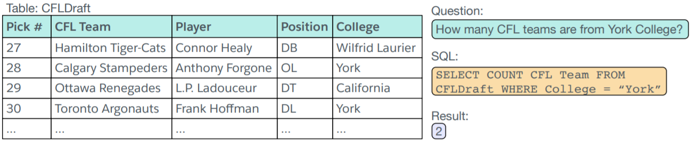
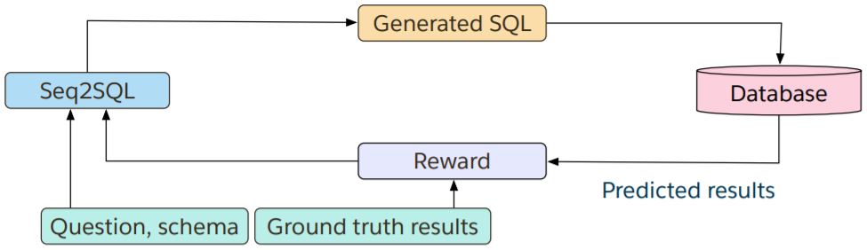
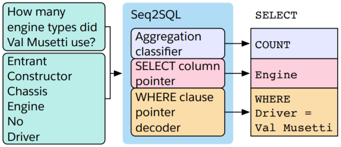

#### Seq2SQL: Generating Structured Queries from Natural Language Using Reinforcement Learning

##### 数据集

发布数据集WikiSQL，下图为数据集中的某个例子。

##### 模型架构

* 组成Seq2SQL的三个组件利用SQL结构剪枝生成查询的输出空间。
* 由于查询条件的无序性，使用policy-based强化学习生成查询条件，而非使用交叉熵损失函数进行优化。
* 使用混合目标训练Seq2SQL，结合交叉熵损失函数和在数据库上执行循环查询得到的强化学习奖励。

##### 基本公式

* 输入序列

  假设一个表有$N$列，第$j$列的列名为$x_j^c = [x_{j, 1}^c, x_{j, 2}^c, \cdots, x_{j, T_j}^c]$，问题单词序列为$x^q$，SQL关键字词汇序列为$x^s$，于是输入序列为
  $$
  x = [\langle \rm{col} \rangle; x_1^c; x_2^c; \cdots; x_N^c; \langle \rm{sql} \rangle; x^s; \langle \rm{question} \rangle; x^q]
  $$

* 编码器

  使用双层双向LSTM网络编码。Encoder的输出序列为$h^{\rm{enc}}$，其中$h_t^{\rm{enc}}$代表输入序列中第$t$个位置的上下文编码。

* 解码器

  使用双层单向LSTM网络解码。对于解码的第$s$步，使用上一步生成的token（$y_{s - 1}$）作为输入，输出状态$g_s$，注意力机制为
  $$
  \begin{aligned}
  \alpha_{s, t}^{\rm{ptr}} & = W^{\rm{ptr}} \tanh(U^{\rm{ptr}} g_s + V^{\rm{ptr}} h_t^{\rm{enc}}) \\
  y_s & = x_{\arg \max_t \alpha_{s, t}^{\rm{ptr}}}
  \end{aligned}
  $$

* 

##### 模型细节分析

模型分为三个组件，分别生成Aggregation Operation、SELECT Column、WHERE Clause。

* Aggregation Operation
  $$
  \begin{aligned}
  \alpha_t^{\rm{inp}} & = W^{\rm{inp}} h_t^{\rm{enc}} \\
  \beta^{\rm{inp}} & = \rm{softmax}(\alpha^{\rm{inp}}) \\
  \kappa^{\rm{agg}} & = \sum_t \beta_t^{\rm{inp}} h_t^{\rm{enc}} \\
  \alpha^{\rm{agg}} & = W^{\rm{agg}} \tanh(V^{\rm{agg}} \kappa^{\rm{agg}} + b^{\rm{agg}}) + c^{\rm{agg}} \\
  \beta^{\rm{agg}} & = \rm{softmax}(\alpha^{\rm{agg}})
  \end{aligned}
  $$
  使用交叉熵损失函数$L^{\rm{agg}}$。

* SELECT Column

  使用与$\kappa^{\rm{agg}}$相同的方法计算$\kappa^{\rm{sel}}$，但是使用不同的参数矩阵。
  $$
  \begin{aligned}
  h_{j, t}^c & = \rm{LSTM}(\rm{emb}(x_{j, t}^c), h_{j, t - 1}^c) \\
  e_j^c & = h_{j, T_j}^c \\
  \alpha_j^{\rm{sel}} & = W^{\rm{sel}} \tanh(V^{\rm{sel}} \kappa^{\rm{sel}} + V^c e_j^c) \\
  \beta^{\rm{sel}} & = \rm{softmax}(\alpha^{\rm{sel}})
  \end{aligned}
  $$
  使用交叉熵损失函数$L^{\rm{sel}}$。

* WHERE Clause

  令$y = [y^1, y^2, \cdots, y^T]$代表生成的WHERE子句，$q(y)$代表模型生成的查询语句，$q_g$代表问题对应的正确查询语句，定义强化学习的奖励函数为
  $$
  R(q(y), q_g) = \left \{ \begin{aligned}
  -2 & , \quad \rm{if} \ q(y) \ \rm{is \ not \ a \ valid \ SQL \ query} \\
  -1 & , \quad \rm{if} \ q(y) \ \rm{is \ a \ valid \ SQL \ query \ and \ executes \ to \ an \ incorrect \ result} \\
  +1 & , \quad \rm{if} \ q(y) \ \rm{is \ a \ valid \ SQL \ query \ and \ executes \ to \ the \ correct \ result}
  \end{aligned} \right .
  $$
  损失函数$L^{\rm{whe}} = - \mathbb{E}_y[R(q(y), q_g)]$。

最终混合目标函数$L = L^{\rm{agg}} + L^{\rm{sel}} + L^{\rm{whe}}$。

##### 实验结果

* 模型performance（执行准确率和完美匹配率）达到SOTA。
* 通过Pointer Network限制输出空间有利于生成更准确的条件子句。
* 考虑SQL结构有利于减少非法查询，大量非法查询原因在于column name。
* 强化学习有利于生成更高质量的条件子句。
