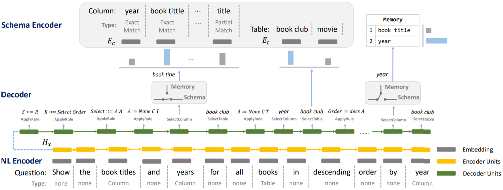
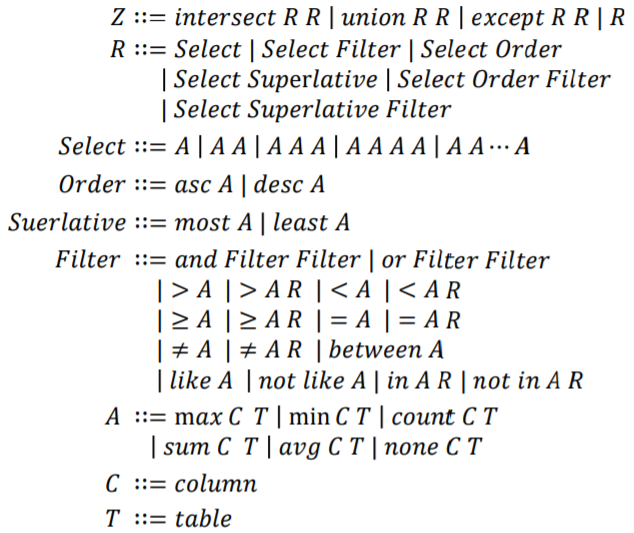

#### Towards Complex Text-to-SQL in Cross-Domain Database with Intermediate Representation

##### 模型架构

* Intermediate Representation

  

  定义介于NL和SQL的中间表示SemQL。FROM子句中的tables包括语法树中所有提到的tables（为了JOIN连通需从schema中加入必要的tables）。Filter节点下的A节点中，none被视为在WHERE子句中，非none被视为在HAVING子句中。GROUPBY子句中的column或来自SELECT子句，或为一个带有聚合函数的table的主键。

* Schema Linking

  枚举问题中长度为1至6的n-grams并从长至短排序，对于每个n-gram，如果其完美匹配一个column或者是一个column的子集，则将其标记为COLUMN，标记为TABLE的过程类似（COLUMN优先级高于TABLE），如果其开头和结尾各为引号则标记为VALUE。一个n-gram如果被标记，则其他与其有重叠的n-grams都被移除。对于标记为COLUMN的n-gram，相对应的column则被标记为EXACT MATCH或PARTIAL MATCH；对于标记为VALUE的n-gram，首先使用ConceptNet查询，仅考虑“is a type of”和“related terms”两种类型的查询结果，然后使用查询结果匹配schema，标记相应的column为VALUE EXACT MATCH或VALUE PARTIAL MATCH。

* NL Encoder

  经过schema linking处理后的问题序列为$x = [(x_1, \tau_1), \cdots, (x_L, \tau_L)]$，其中$x_i$为第$i$个span，$\tau_i$为第$i$个span的类型。对$x_i$中所有单词和$\tau_i$的embeddings取平均，得到第$i$个span的初始embedding。然后使用双向LSTM对整个序列编码，计算得到$H_x$。

* Schema Encoder

  
