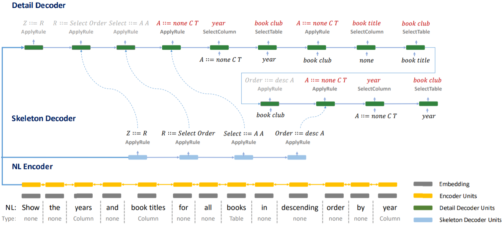

#### Towards Complex Text-to-SQL in Cross-Domain Database with Intermediate Representation

##### 模型架构

* Intermediate Representation

  

  定义介于NL和SQL的中间表示SemQL。FROM子句中的tables包括语法树中所有提到的tables（为了JOIN连通需从schema中加入必要的tables）。Filter节点下的A节点中，none被视为在WHERE子句中，非none被视为在HAVING子句中。GROUPBY子句中的column或来自SELECT子句，或为一个带有聚合函数的table的主键。

* Schema Linking

  

  枚举问题中长度为1至6的n-grams并从长至短排序，对于每个n-gram，如果其完美匹配一个column或者是一个column的子集，则将其标记为COLUMN，标记为TABLE的过程类似（COLUMN优先级高于TABLE），如果其开头和结尾各为引号则标记为VALUE。一个n-gram如果被标记，则其他与其有重叠的n-grams都被移除。对于标记为COLUMN的n-gram，相对应的column则被标记为EXACT MATCH或PARTIAL MATCH；对于标记为VALUE的n-gram，首先使用ConceptNet查询，仅考虑“is a type of”和“related terms”两种类型的查询结果，然后使用查询结果匹配schema，标记相应的column为VALUE EXACT MATCH或VALUE PARTIAL MATCH。

* NL Encoder

  经过schema linking处理后的问题序列为$x = [(x_1, \tau_1), \cdots, (x_L, \tau_L)]$，其中$x_i$为第$i$个span，$\tau_i$为第$i$个span的类型。对$x_i$中所有单词和$\tau_i$的embeddings取平均，得到第$i$个span的初始embedding $e_x^i$。然后使用双向LSTM对$e_x$编码，计算得到$H_x$。

* Schema Encoder

  令$s = (c, t)$为数据库schema，其中$c = \{(c_1, \phi_1), \cdots , (c_n, \phi_n)\}$为不同的columns和相应的标记类型，$t = \{t_1, \cdots, t_m\}$为tables的集合。对于column，对$c_i$中所有单词的embeddings取平均得到$\tilde{e}_c^i$，$\phi_i$的embedding为$\varphi_i$。
  $$
  \begin{aligned}
  g_k^i & = \frac{(\tilde{e}_c^i)^T e_x^k}{||\tilde{e}_c^i|| ||e_x^k||} \\
  c_c^i & = \sum_{k = 1}^L g_k^i e_x^k \\
  e_c^i & = \tilde{e}_c^i + c_c^i + \varphi_i
  \end{aligned}
  $$
  对于table，计算$e_t^i$的方法类似，只是没有类型编码。
  
* BERT（可选项）

  以一定方式连接问题中的所有spans和schema中的所有columns，然后使用BERT得到hidden states。对于span，其最终表示为span中所有单词的hidden states取平均；对于column，使用双向LSTM处理column中所有单词的hidden states，最终表示为双向LSTM的结果加上类型的embedding。对tables的处理方法类似。
  
* Decoder

  解码的过程与YN17模型类似，每个动作分为APPLYRULE、SELECTCOLUMN、SELECTTABLE。对于SELECTCOLUMN，column可能从schema或memory中选取，如果某个column被选择，它会被加入memory而且从schema中移除。
  $$
  \begin{aligned}
  p(a_i = {\rm SELECTCOLUMN}[c] | x, s, a_{< i}) & = p({\rm MEM} | x, s, a_{< i}) \cdot p(c | x, s, a_{< i}, {\rm MEM}) + p({\rm S} | x, s, a_{< i}) \cdot p(c | x, s, a_{< i}, {\rm S}) \\
  p({\rm MEM} | x, s, a_{< i}) & = {\rm sigmoid}(w_m^T v_i) \\
  p({\rm S} | x, s, a_{< i}) & = 1 - p({\rm MEM} | x, s, a_{< i}) \\
  p(c | x, s, a_{< i}, {\rm MEM}) & = {\rm softmax}(v_i^T E_c^m) \\
  p(c | x, s, a_{< i}, {\rm S}) & = {\rm softmax}(v_i^T E_c^s)
  \end{aligned}
  $$
  $v_i$是通过注意力机制根据$H_x$计算得到的上下文向量，$E_c^m$和$E_c^s$分别是memory和schema中columns的embeddings组成的矩阵。对于SELECTTABLE，
  $$
  p(a_i = {\rm SELECTTABLE}[t] | x, s, a_{< i}) = {\rm softmax}(v_i^T E_t)
  $$

* Coarse-to-Fine Framework

  

  先生成SemQL的skeleton（A节点不再向下扩展），然后再生成具体的SemQL。

##### 实验结果

* performance达到SOTA，而且使用BERT会有更大的提升。
* 模型预测SemQL语句相比于预测SQL语句，performance明显提升，说明了SemQL作为中间表示的作用。
* schema linking、memory augmented pointer network、coarse-to-fine framework等部件均起到作用。
* 最多的错误来自column预测，column未在问题中提到，或仅部分提到；其次来自嵌套查询，提升生成复杂查询语句的能力仍需数据集扩展；最末来自operator预测，需要一定的常识。
* dev和test之间存在performance gap。

##### 未来工作

* 支持self join。
* 目前没有完全解决NL和SQL的不匹配问题。
* 提出更好的中间表示。
