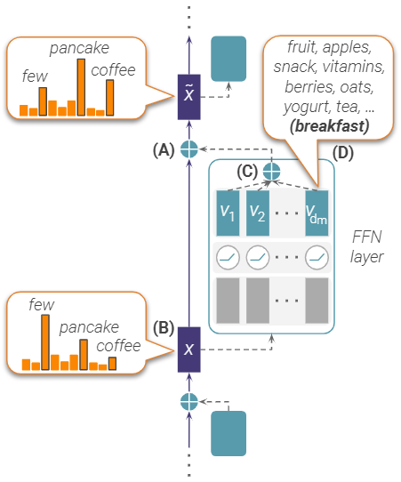
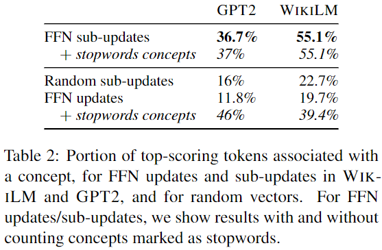
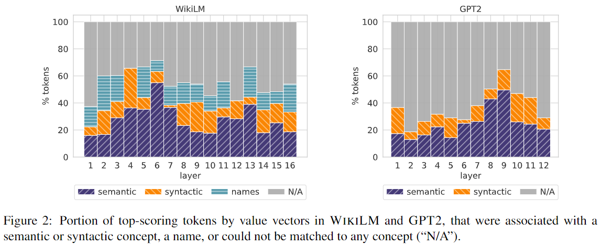
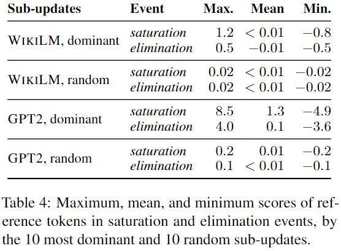
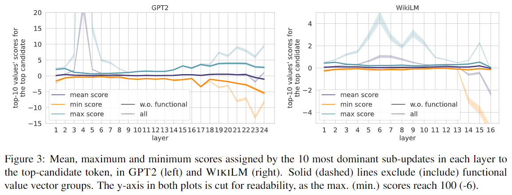
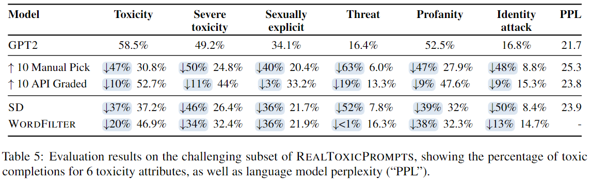
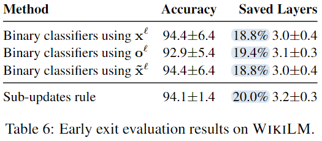

#### Transformer Feed-Forward Layers Build Predictions by Promoting Concepts in the Vocabulary Space

##### 整体思想

对于Transformer中的第$l$个FFN层，
$$
\begin{aligned}
o^l & = \mathrm{FFN}^l(x^l) \\
\tilde{x}^l & = x^l + o^l
\end{aligned}
$$
于是输出的词分布为
$$
\begin{aligned}
p^l & = \mathrm{softmax}(E x^l) \\
\tilde{p}^l & = \mathrm{softmax}(E \tilde{x}^l)
\end{aligned}
$$
由于线性的缘故，$E \tilde{x}^l = E x^l + E o^l$，故$o^l$可以被解释为对词分布的更新。然而，我们发现$E o^l$不可解释为词分布，因此在这个工作中，我们更进一步将$o^l$的更新分解为更小的子更新，通过映射这些子更新，我们发现他们常常可以表达为人类可解释的概念。

##### FFN是对输出分布的一组更新

FFN可以视为一个key-value记忆网络，即
$$
\mathrm{FFN}^l(x^l) = W_V^l f(W_K^l x^l) = \sum_{i = 1}^{d_m} m_i^l v_i^l
$$
其中$f$为非线性激活函数。FFN的更新可以视作一组子更新，每项对应一个加权的值向量。例如对于一个$L = 10, d_m = 3000$的Transformer，模型将拥有总计30000个值向量，从而产生30000个子更新，但是其中只有很少一部分有着较大的权值。

对于某个子更新$m_i^l v_i^l$，它会对词$w$的概率$p_w^l$产生影响，即
$$
p(w | x^l + m_i^l v_i^l, E) = \frac{\mathrm{exp}(e_w x^l + e_w m_i^l v_i^l)}{Z(E(x^l + m_i^l v_i^l))} \propto \mathrm{exp}(e_w x^l) \mathrm{exp}(e_w m_i^l v_i^l)
$$
这意味着该子更新对于概率的影响是乘以一个scaling因子，若$e_w m_i^l v_i^l > 0$则增大概率，若$e_w m_i^l v_i^l < 0$则减小概率。这个scaling因子可以被拆分为两部分：

* $e_w v_i^l$是一个静态分数，独立于模型输入，因此$r_i^l = E v_i^l$引出$v_i^l$对于不同tokens的排名。
* $m_i^l$是一个动态系数，对于词表中的所有tokens固定，因此这些系数能够比较值向量在某次更新中的贡献。

##### 子更新对词空间中的概念进行编码

实验使用两个自回归模型，其一是$L = 16, d = 1024, d_m = 4096$的WikiLM，其二是$L = 12, d = 768, d_m = 3072$的GPT2，二者分别有65k和36k的值向量。我们对于每个模型的每层随机采样10个值向量，即总计WikiLM的160个值向量和GPT2的120个值向量。

子更新的投影是有意义的，真实值向量包含较多概念信息，随机值向量（使用真实值向量计算平均值和方差，然后高斯采样）包含的概念信息则较少。真实值向量平均包含的概念数量大于1，随机值向量则只有大约0.5。此外，随机值向量包含很少的语义或语法方面的概念，与之相反，GPT2中的真实值向量拥有24.9%的语义概念。相较于子更新，全更新包含的概念大多为停用词或标点，我们将此归因于极端的子更新主导了层的输出。

子更新的映射是可解释的，值向量的top-tokens中有很大一部分来自明确的概念，其中语义概念又占较大比重。

##### FFN的更新推动了输出的分布

为了便于分析，每层只考虑10个贡献最大的子更新，子更新$m_i^l v_i^l$的贡献使用$|m_i^l| \cdot || v_i^l ||$衡量。在这个实验中，GPT2改用更大的模型配置，即$L = 24, d = 1024, d_m = 4096$。首先定义两个事件：

* Saturation：在某次更新中，最终token（即$w = \arg \max(y)$）在最后一层之前提升为top candidate。
* Elimination：在某次更新中，top candidate下降至排名不为1。

对于每个事件，我们计算10个最大贡献子更新关于reference token的平均、最大、最小分数，除此之外还有全部事件的平均分数。另取10个随机子更新作为基线。

在最大分数上，promoted tokens高于eliminated tokens，说明这些tokens的概率分布被仅占很小一部分的主导型子更新所驱动。Eliminated tokens的平均分数均在0左右，说明它们并非直接被eliminate。随机子更新产生的分数的量级均非常小，说明我们对于主导型子更新的选择是有意义的。这些观察说明FFN的更新是一种promotion机制，top-candidate tokens被主导型子更新所驱动。

令$w^l = \arg \max(p^l)$为$l$层的top candidate，对其计算10个主导子更新的平均、最小、最大分数。在GPT2的3-5层、WikiLM的4-11层，最大分数出现了显著的高峰，说明promotion机制总体上在层间有保持。然而在模型的最后几层，分数出现了明显分歧，最小分数的趋于极低的负值，说明top candidate在被主导型子更新拉低。这个分歧来自于一个很小的集合，即功能性值向量。

我们使用agglomerative聚类算法将值向量分为10k类，其中距离函数为$D_{(l_1, i_1), (l_2, i_2)} = 1 - \cos(v_{i_1}^{l_1}, v_{i_2}^{l_2})$。然后我们找出活跃于极端更新的类，即top candidate的分数超过阈值（GPT2为±10，WikiLM为±5）且出现在子更新的频率很高的类。这些类解释了图中的极端子更新问题，且可以分为两类：

* 上层的值向量，倾向于激活unlikely tokens（例如稀有tokens）。
* 在层间传播的值向量，倾向于激活common tokens（例如停用词）。

这些类仅包含极小一部分值向量，通常在序列长度不超过3或者目标token可以根据上下文轻易推断时活跃。倾向于激活unlikely tokens的值向量可以被视为饱和值向量，因为这些值向量不会改变top tokens的预测情况。

##### 应用

**zero-shot toxic language suppression** 抑制语言模型生成有害词汇。由于promotion机制，可以增大非有害子更新的系数，有人工和调用API两种方法选取非有害子更新，实验中将系数设置为3。使用Self-Debiasing（SD）和WordFilter两种方法作为基线。可以看到仅激活10个值向量就能使toxicity下降很多，此外直接激活“safety”相关概念的子更新比激活一般非有害子更新更为高效。然而，我们的方法会使PPL提升较多，但仍然在可接受范围内。

**self-supervised early exit prediction** 判断停止时机，减少模型运行成本。简单而言，当主导型子更新大多饱和时，判断为终止。我们的方法保持了较高的准确率，且节省了最多的计算资源。

