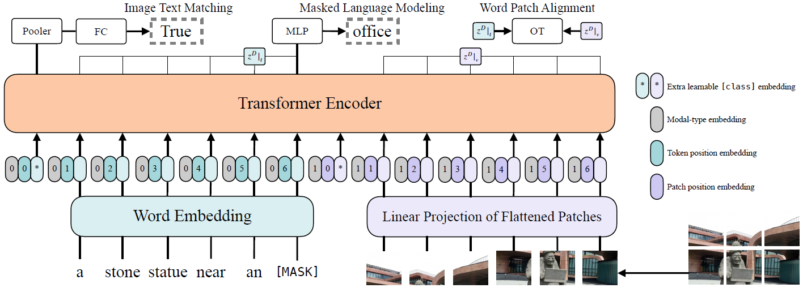

#### ViLT: Vision-and-Language Transformer Without Convolution or Region Supervision

##### 模型架构

采用类似Vision Transformer的结构，embedding为词（或patch）嵌入+Position Embedding+Modal Type Embedding。经过Transformer Encoder后，第一个位置经过Pooler（$p = \tanh(z_0^D W_{pool})$）和全连接层用于分类，文本部分经过MLP用于MLM，文本部分与图像部分联合用于Word Patch Alignment。

##### 预训练任务

* ITM（Image Text Matching）：以50%的概率随机替换原本与文本对齐的图像，以负对数计算ITM loss，另外用IPOT（Inexact Proximal Point Method for Optimal Transports）的方法计算WPA loss，将计算得到的Wasserstein Distance乘以0.1加至ITM loss。
* MLM（Masked Language Modeling）：类似于BERT，使用Whole Word Masking避免[MASK]被左右子词预测而忽略图像信息。

##### 微调阶段

微调任务：

* Classification
* Retrieval

对于Image Augmentation，使用RandAugment，但去掉Color Inversion（因为文本可能包含颜色信息）和Cutout（避免分散在整个图像中的小但重要的物体被切除）。

##### 实验结果

* 表现一般（competitive），但是速度很快，参数量小。
* 更多的训练steps、Whole Word Masking、Image Augmentation有利于模型表现。
* MPP（Masked Patch Prediction）对模型训练无用。

##### 遗留问题

* Scalabi：模型规模可以更大。
* Masked Modeling for Visual Inputs：可以在摆脱Region Supervision的前提下，尝试其他有效的mask方法。
* Augmentation Strategies：可以尝试高斯模糊等其他augmentation方法。
