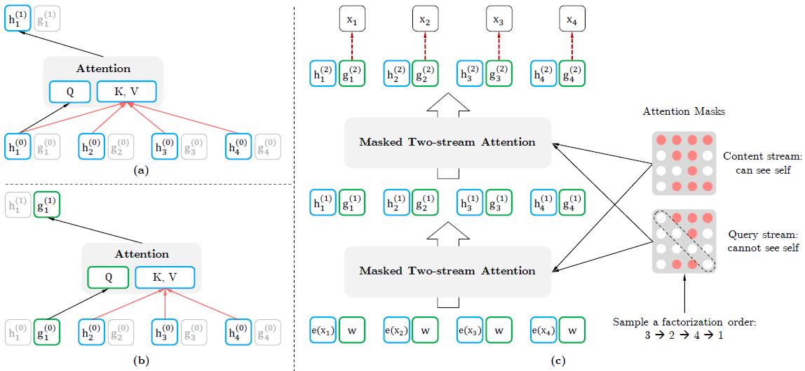

#### XLNet: Generalized Autoregressive Pretraining for Language Understanding

##### 针对问题

* Autoregressive模型缺乏对双向信息的利用，XLNet则通过全排列的方法利用双向信息。
* BERT使用[MASK]对信息加噪，造成预训练和微调不一致，而且无法自回归，XLNet则没有这个问题。

##### 模型架构

基本架构为Autoregressive模型，但通过全排列的方法利用双向信息。所谓的全排列并不是真正改变sequence的位置顺序，而是通过attention mask实现。仅仅改变attention mask会导致不可学习，故使用Two-Stream Self-Attention。

基于Transformer-XL，同样使用Relative Positional Encoding和Segment Recurrence。

##### 实验结果

* performance优于BERT和RoBERTa。
* 对于长context的数据集优势更加明显。
