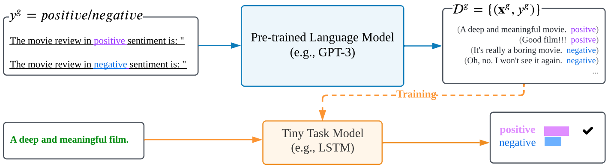

#### ZeroGen: Efficient Zero-shot Learning via Dataset Generation

##### ZeroGen

使用大规模预训练语言模型以及prompt扩增数据集，用于训练小任务模型。对于句子对分类任务，首先生成上下文，然后根据上下文和标签生成问题。

##### 实验结果

* 相比于Prompting，ZeroGen不仅性能好，而且训练出来的模型规模小很多。
* 相比于监督学习，ZeroGen性能有时较优有时较劣，总体来说构造的数据集规模越大性能越好。
* ZeroGen可以用于评估预训练语言模型的生成能力，在不同的解码策略下，构造数据集的多样性与正确性之间存在tradeoff。
* 自然语言风格的prompt效果最好，ZeroGen相比Prompting性能与鲁棒性均更好，两阶段prompt同时有利于多样性与正确性。
